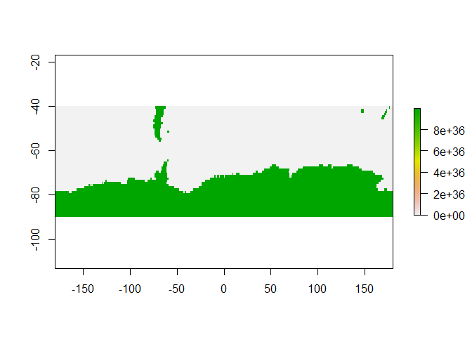
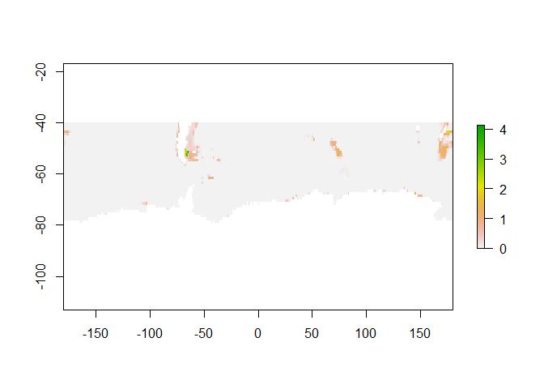
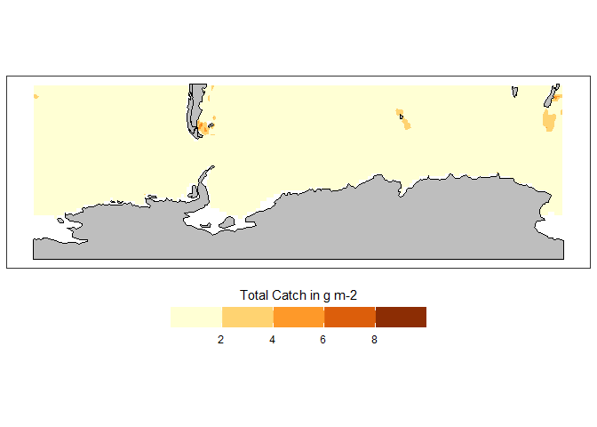

Accessing data from ISIMIP repository
================
Denisse Fierro Arcos
2022-08-17

- <a href="#introduction" id="toc-introduction">Introduction</a>
  - <a href="#loading-r-libraries" id="toc-loading-r-libraries">Loading R
    libraries</a>
  - <a href="#setting-up-python-for-use-in-an-r-notebook"
    id="toc-setting-up-python-for-use-in-an-r-notebook">Setting up Python
    for use in an R notebook</a>
- <a href="#python-based-code" id="toc-python-based-code">Python-based
  code</a>
  - <a href="#loading-isimip-client-script"
    id="toc-loading-isimip-client-script">Loading ISIMIP Client script</a>
  - <a href="#search-isimip-repository"
    id="toc-search-isimip-repository">Search ISIMIP repository</a>
    - <a href="#optional-step" id="toc-optional-step">Optional step</a>
  - <a href="#downloading-data-to-disk"
    id="toc-downloading-data-to-disk">Downloading data to disk</a>
- <a href="#r-based-code" id="toc-r-based-code">R-based code</a>
  - <a href="#inspecting-contents-of-netcdf-file"
    id="toc-inspecting-contents-of-netcdf-file">Inspecting contents of
    netcdf file</a>
  - <a href="#loading-dataset-as-dataframe-for-easy-manipulation"
    id="toc-loading-dataset-as-dataframe-for-easy-manipulation">Loading
    dataset as dataframe for easy manipulation</a>
  - <a href="#calculating-climatology"
    id="toc-calculating-climatology">Calculating climatology</a>
  - <a href="#plotting-climatology" id="toc-plotting-climatology">Plotting
    climatology</a>

# Introduction

This notebook will accessing data from the [Inter-Sectoral Impact Model
Intercomparison Project (ISIMIP) Repository](https://data.isimip.org/).
There are various datasets available, but as example we will be
accessing Output Data \> Fisheries & Marine Ecosystems (global) sector
\> ISIMIP3b simulation.

In this notebook, we will use `Python` to make use of some functions
from the `isimip-client` library available in
[GitHub](https://github.com/ISI-MIP/isimip-client). We will then move to
`R` to examine and manipulate the data.

## Loading R libraries

``` r
library(reticulate)
library(tidyverse)
library(metR)
library(lubridate)
library(raster)
library(sf)
```

## Setting up Python for use in an R notebook

Using the `reticulate` package. You have the option to set the path of
`Python` installation using
`reticulate::use_python("PATH_TO_PYTHON_INSTALLATION")`. If you do not
know the location of the `Python` in your machine, you can use the
`Sys.which()` function in `R`. We can combine these two functions to
call `Python` in this notebook like this:
`use_python(as.character(Sys.which("python")))`.

However, since a conda environment containing the specific `Python`
libraries needed to run this and all notebooks in the repository is
provided here, we will use this option instead. To point to a specific
conda environment we use the function
`reticulate::use_condaenv("name_conda_environment")`. For information on
how to install the conda environment, refer to the
[README](../README.md) file.

``` r
#Calling a specific conda environment
use_condaenv("CMIP6_data")
```

# Python-based code

## Loading ISIMIP Client script

The ISIMIP-Client Python package is available online in their
[repository](https://github.com/ISI-MIP/isimip-client). This library is
available in our conda environment, but you can install it in your local
machine using the following line:
`!pip install git+https://github.com/ISI-MIP/isimip-client` inside a
`Python` chunk or in the command line if you remove the `!` at the
beginning.

We will now load the `ISIMIP client` library and start a session in our
notebook so we can start quertying the ISIMIP repository and downloading
the data we need.

``` python
#Loading the library
import isimip_client.client as cl

#Starting a session
client = cl.ISIMIPClient()
```

## Search ISIMIP repository

You can create a query specifying several attributes of the dataset of
your interest. In this case, we are interested in Total Catch (`tc` for
short), which is a type of Output Data from the ISIMIP3b simulation. For
this example, we have also specified an ecological model (`EcoOcean`),
the climate forcing used (`GFDL-ESM4` model) and the climate scenario
(`historical`).

``` python
query = client.datasets(simulation_round = 'ISIMIP3b',\
                           product = 'OutputData',\
                           climate_forcing = 'gfdl-esm4',\
                           climate_scenario = 'historical',\
                           model = 'ecoocean',\
                           variable = 'tc')

query
```

    ## {'count': 1, 'next': None, 'previous': None, 'results': [{'id': '09906cea-868c-4ba1-8261-a9f07d728930', 'name': 'ecoocean_gfdl-esm4_nobasd_historical_histsoc_default_tc_global_monthly', 'path': 'ISIMIP3b/OutputData/marine-fishery_global/EcoOcean/gfdl-esm4/historical/ecoocean_gfdl-esm4_nobasd_historical_histsoc_default_tc_global_monthly', 'paths': ['ISIMIP3b/OutputData/marine-fishery_global/EcoOcean/gfdl-esm4/historical/ecoocean_gfdl-esm4_nobasd_historical_histsoc_default_tc_global_monthly'], 'version': '20211130', 'size': 116293296, 'specifiers': {'model': 'ecoocean', 'period': 'historical', 'region': 'global', 'sector': 'marine-fishery_global', 'product': 'OutputData', 'variable': 'tc', 'time_step': 'monthly', 'soc_scenario': 'histsoc', 'sens_scenario': 'default', 'bias_adjustment': 'nobasd', 'climate_forcing': 'gfdl-esm4', 'climate_scenario': 'historical', 'simulation_round': 'ISIMIP3b'}, 'identifiers': ['simulation_round', 'product', 'sector', 'model', 'climate_forcing', 'period', 'bias_adjustment', 'climate_scenario', 'soc_scenario', 'sens_scenario', 'variable', 'region', 'time_step'], 'search_rank': 0.0, 'public': True, 'merged_specifiers': {'model': ['ecoocean'], 'period': ['historical'], 'region': ['global'], 'sector': ['marine-fishery_global'], 'product': ['OutputData'], 'variable': ['tc'], 'time_step': ['monthly'], 'soc_scenario': ['histsoc'], 'sens_scenario': ['default'], 'bias_adjustment': ['nobasd'], 'climate_forcing': ['gfdl-esm4'], 'climate_scenario': ['historical'], 'simulation_round': ['ISIMIP3b']}, 'pretty_specifiers': {'Simulation round': ['ISIMIP3b simulation round'], 'Data product': ['Output Data'], 'Sector': ['Fisheries and Marine Ecosystems (global)'], 'Model': ['EcoOcean'], 'Climate forcing': ['GFDL-ESM4'], 'Period': ['Historical'], 'Bias adjustment': ['nobasd'], 'Climate scenario': ['historical'], 'Socio-economic scenario': ['histsoc'], 'Sensitivity scenario': ['default'], 'Variable': ['tc'], 'Region': ['Global'], 'Time step': ['monthly']}, 'url': 'https://data.isimip.org/api/v1/datasets/09906cea-868c-4ba1-8261-a9f07d728930/', 'metadata_url': 'https://data.isimip.org/datasets/09906cea-868c-4ba1-8261-a9f07d728930/', 'filelist_url': 'https://data.isimip.org/api/v1/datasets/09906cea-868c-4ba1-8261-a9f07d728930/filelist/', 'rights': {'rights': 'CC0 1.0 Universal Public Domain Dedication', 'rights_uri': 'https://creativecommons.org/publicdomain/zero/1.0/', 'short': 'CC0 1.0', 'image': 'images/cc/cc0.png', 'color': 'info'}, 'files': [{'id': '6e7b1fb0-3a6b-462e-ac21-48083e4c0dca', 'name': 'ecoocean_gfdl-esm4_nobasd_historical_histsoc_default_tc_global_monthly_1950_2014.nc', 'path': 'ISIMIP3b/OutputData/marine-fishery_global/EcoOcean/gfdl-esm4/historical/ecoocean_gfdl-esm4_nobasd_historical_histsoc_default_tc_global_monthly_1950_2014.nc', 'paths': ['ISIMIP3b/OutputData/marine-fishery_global/EcoOcean/gfdl-esm4/historical/ecoocean_gfdl-esm4_nobasd_historical_histsoc_default_tc_global_monthly_1950_2014.nc'], 'version': '20211130', 'size': 116293296, 'checksum': 'e48fecc23d44f346499b1974d968d87662c820eb09e3e1e908f58a3f3c534e39d736a930f395db9e0e1c81b51a1014484f6e0e2f4fafc1009fa703d309605196', 'checksum_type': 'sha512', 'url': 'https://data.isimip.org/api/v1/files/6e7b1fb0-3a6b-462e-ac21-48083e4c0dca/', 'metadata_url': 'https://data.isimip.org/files/6e7b1fb0-3a6b-462e-ac21-48083e4c0dca/', 'file_url': 'https://files.isimip.org/ISIMIP3b/OutputData/marine-fishery_global/EcoOcean/gfdl-esm4/historical/ecoocean_gfdl-esm4_nobasd_historical_histsoc_default_tc_global_monthly_1950_2014.nc', 'rights': {'rights': 'CC0 1.0 Universal Public Domain Dedication', 'rights_uri': 'https://creativecommons.org/publicdomain/zero/1.0/', 'short': 'CC0 1.0', 'image': 'images/cc/cc0.png', 'color': 'info'}, 'terms_of_use': {'terms_of_use': 'When using ISIMIP data for your research, please appropriately credit the data providers, e.g. either by citing the DOI for the dataset, or by appropriate acknowledgment. We strongly encourage to offer co-authorship to at least a representative of the data providers.', 'terms_of_use_url': 'https://www.isimip.org/gettingstarted/terms-of-use/#general-terms-of-use-for-all-isimip-data-on-the-esg-server'}}], 'links': [], 'resources': [], 'caveats': None, 'annotations': None, 'indicators': None, 'terms_of_use': {'terms_of_use': 'When using ISIMIP data for your research, please appropriately credit the data providers, e.g. either by citing the DOI for the dataset, or by appropriate acknowledgment. We strongly encourage to offer co-authorship to at least a representative of the data providers.', 'terms_of_use_url': 'https://www.isimip.org/gettingstarted/terms-of-use/#general-terms-of-use-for-all-isimip-data-on-the-esg-server'}, 'is_global': True, 'is_netcdf': True}]}

This query will return a Python dictionary with the results of your
search. You can find the name of the keys in the dictionary by typing
`query.keys()`. You can inspect the search results by typing
`query['name_of_key"]`.

For example, the `query['count']` contains the total number of datasets
which met your search requirements. In this case, we found 1 datasets
meeting our search requirements.

We can also check the additional metadata associated stored in
`query['results']` as shown below.

``` python
#We will loop through all search results available
for dataset in query['results']:
  #Print metadata for each entry
  print(dataset['specifiers'])
```

    ## {'model': 'ecoocean', 'period': 'historical', 'region': 'global', 'sector': 'marine-fishery_global', 'product': 'OutputData', 'variable': 'tc', 'time_step': 'monthly', 'soc_scenario': 'histsoc', 'sens_scenario': 'default', 'bias_adjustment': 'nobasd', 'climate_forcing': 'gfdl-esm4', 'climate_scenario': 'historical', 'simulation_round': 'ISIMIP3b'}

It is worth noting that the files in the search results include data for
the entire planet. If you would like to

can be downloaded to disk by extracting the URLs from the dictionary. If
a subset of the global data is needed, then the paths information is
necessary. Here we will save both options.

``` python
#Empty lists to save URLs linking to files
urls = []
urls_sub = []

#Looping through each entry available in search results
for datasets in query['results']:
  for paths in dataset['files']:
    urls.append(paths['file_url'])
    urls_sub.append(paths['path'])
```

### Optional step

If you are looking for a subset of the global dataset, you can set a
bounding box and only extract data for your area of interest. In this
case, we will extract information for the Southern Ocean only.

``` python
#We use the cutout function to create a bounding box for our dataset
SO_data_URL = client.cutout(urls_sub, bbox = [-90, -40, -180, 180])
```

## Downloading data to disk

We will download the data and store it into the `data` folder. First we
will make sure a `data` folder exists and if it does not exist, we will
create one.

``` python
#Importing library to check if folder exists
import os

#Creating a data folder if one does not already exist
if os.path.exists('../Data/') == False:
  os.makedirs('../Data/')
else:
  print('Folder already exists')
```

    ## Folder already exists

Use the `client.download()` function to save data to disk.

``` python
#To download the subsetted data
client.download(url = SO_data_URL['file_url'], \
                path = '../Data/', validate = False, \
                extract = True)
```

To download global data we use the same function, but we need to point
at the correct variable storing the URL to the global dataset.

``` python
client.download(url = urls[0], \
                path = '../Data/', validate = False, \
                extract = True)
```

# R-based code

You are now ready to load the dataset into `R` to make any calculations
and visualise results.

## Inspecting contents of netcdf file

For a quick overview of the content of the dataset we just downloaded,
we can make use of the `metR` package.

``` r
#Provide file path to netcdf that was recently downloaded.
data_file <- list.files(path = "../Data/", pattern = "nc$", full.names = T)

#Check contents of netcdf
GlanceNetCDF(data_file)
```

    ## ----- Variables ----- 
    ## tc:
    ##     Total Catch (all commercial functional groups / size classes) in g m-2
    ##     Dimensions: lon by lat by time
    ## 
    ## 
    ## ----- Dimensions ----- 
    ##   lat: 50 values from -89.5 to -40.5 degrees_north
    ##   lon: 360 values from -179.5 to 179.5 degrees_east
    ##   time: 780 values from 1955-01-30 12:39:26 to 2020-12-10 20:00:09

This output, however, does not give you information about
`No Data Values`. So we will load the first timestep included in our
dataset to obtain this information.

We will also plot the data to inspect it quickly.

``` r
#Loading the first timestep as raster
tc_raster <- raster(data_file, band = 1)

#Extracting missing values
NA_val <- tc_raster@file@nodatavalue

#Plotting raster
plot(tc_raster)
```

<!-- -->
We can see that a `No Data Values` is included in the dataset to mark
areas where no values have been collected because all land areas have
the same value.

We can create a mask for the `No Data Values` and plot the raster again.

``` r
#Changing values larger than No Data Value to NA
tc_raster[tc_raster >= NA_val] <- NA

#Plotting result
plot(tc_raster)
```

<!-- -->

## Loading dataset as dataframe for easy manipulation

This data type allows us to use the `tidyverse` to make calculations
easily.

As seen from plotting the raster above, we must first mask
`No Data Values` before we carry out any calculations.

``` r
#Loading dataset as data frame
tc_SO <- ReadNetCDF(data_file, vars = "tc") %>% 
  #Masking No Data Values
  mutate(tc = case_when(tc >= NA_val ~ NA_real_,
         T ~ tc))
```

    ## Warning in as.POSIXct.PCICt(PCICt::as.PCICt(time, cal = calendar, origin =
    ## origin), : 360-day PCICt objects can't be properly represented by a POSIXct
    ## object

## Calculating climatology

We will use all data between 1960 and 2020 to calculate the
climatological mean of total catch for the Southern Ocean.

``` r
clim_tc <- tc_SO %>% 
  #Extracting data between 1960 and 2020
  filter(year(time) >= 1960 & year(time) <= 2020) %>% 
  #Calculating climatological mean for total catch per pixel
  group_by(lat, lon) %>% 
  summarise(mean_tc = mean(tc, na.rm = F))
```

    ## `summarise()` has grouped output by 'lat'. You can override using the `.groups`
    ## argument.

## Plotting climatology

``` r
#Switching off spherical geometry prior to accessing and cropping world shapefile
sf_use_s2(F)
```

    ## Spherical geometry (s2) switched off

``` r
#Accessing coastline shapefiles
land <- rnaturalearth::ne_countries(returnclass = "sf") %>% 
  #Extracting land within data boundaries
  st_crop(ymin = -90, ymax = -40, 
            xmin = -180, xmax = 180)
```

    ## although coordinates are longitude/latitude, st_intersection assumes that they are planar

    ## Warning: attribute variables are assumed to be spatially constant throughout all
    ## geometries

``` r
#Plotting data
clim_tc %>% 
  ggplot(aes(y = lat, x = lon))+
  geom_contour_fill(aes(z = mean_tc, fill = stat(level)),
                        binwidth = 2)+
  scale_fill_distiller(palette = "YlOrBr", 
                       direction = 1, 
                       super = ScaleDiscretised)+
  guides(fill = guide_colorbar(title.position = "top",
                               title.hjust =  0.5,
                               barwidth = 15))+
  geom_sf(data = land, inherit.aes = F,
          fill = "grey", color = "black")+
  labs(x = NULL, y = NULL, 
       fill = "Total Catch in g m-2")+
  theme_bw()+
  theme(panel.grid = element_blank(),
        legend.position = "bottom")
```

<!-- -->
