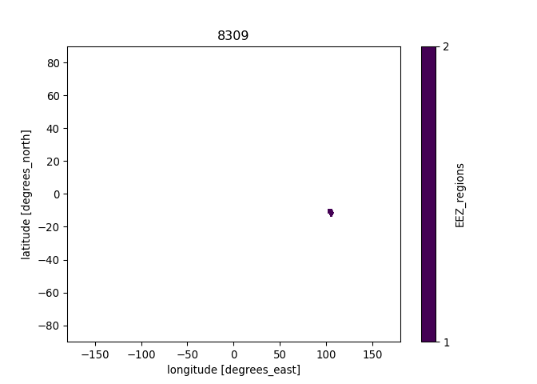
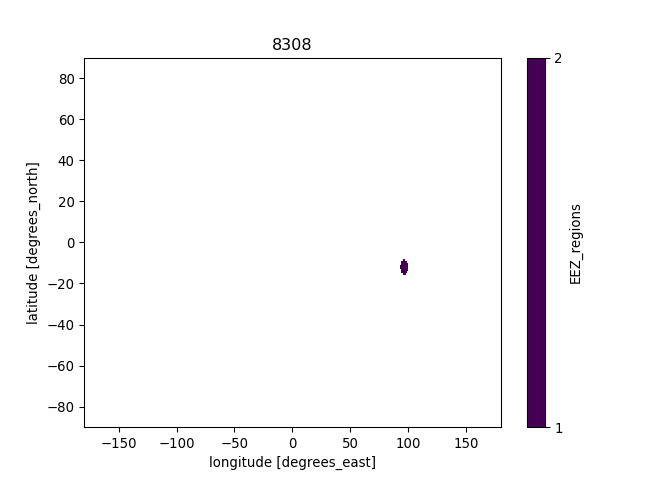
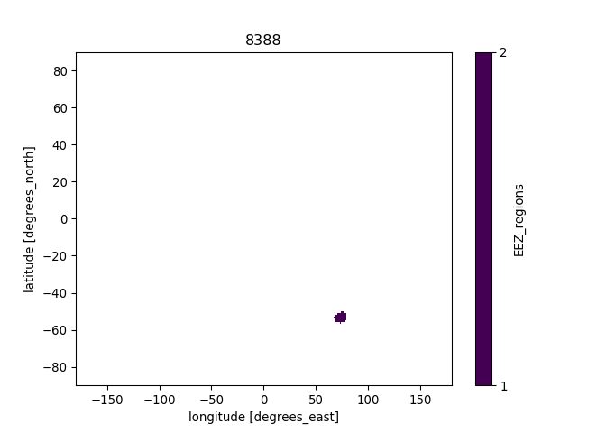
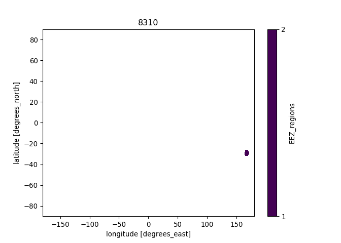
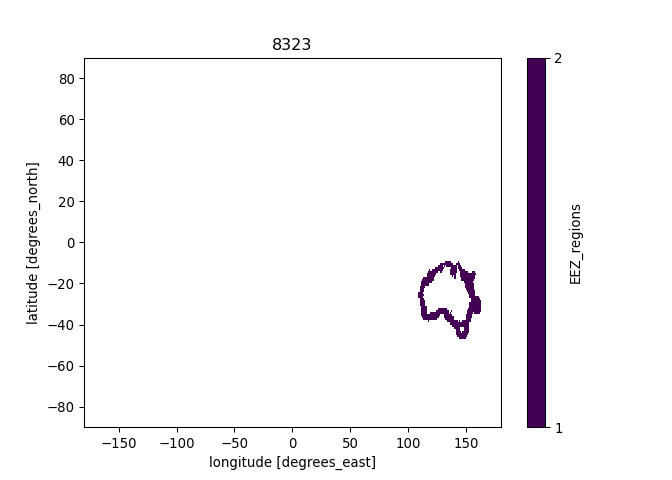
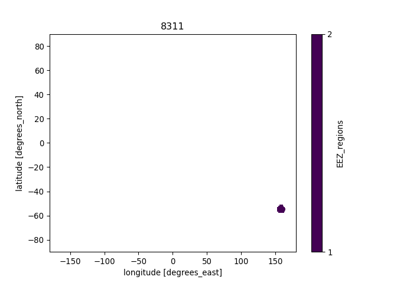

Creating raster mask from EEZs of the world shapefile
================
Denisse Fierro Arcos
2022-11-07

- <a href="#introduction" id="toc-introduction">Introduction</a>
- <a href="#loading-r-libraries" id="toc-loading-r-libraries">Loading R
  libraries</a>
- <a href="#loading-shapefiles" id="toc-loading-shapefiles">Loading
  shapefiles</a>
- <a href="#plotting-fao-regions-shapefile"
  id="toc-plotting-fao-regions-shapefile">Plotting FAO regions
  shapefile</a>
- <a href="#extracting-names-and-codes-for-eez"
  id="toc-extracting-names-and-codes-for-eez">Extracting names and codes
  for EEZ</a>
- <a href="#creating-a-multilayer-raster-mask-based-on-merged-shapefile"
  id="toc-creating-a-multilayer-raster-mask-based-on-merged-shapefile">Creating
  a multilayer raster mask based on merged shapefile</a>
  - <a href="#loading-input-rasters" id="toc-loading-input-rasters">Loading
    input rasters</a>
  - <a href="#defining-function-to-create-rasters-from-shapefiles"
    id="toc-defining-function-to-create-rasters-from-shapefiles">Defining
    function to create rasters from shapefiles</a>
  - <a href="#applying-raster-creation-function"
    id="toc-applying-raster-creation-function">Applying raster creation
    function</a>
- <a href="#python-based-code"
  id="toc-python-based-code"><code>Python</code>-based code</a>
  - <a href="#loading-libraries" id="toc-loading-libraries">Loading
    libraries</a>
  - <a href="#loading-raster-using-xarray"
    id="toc-loading-raster-using-xarray">Loading raster using
    <code>xarray</code></a>
  - <a href="#plotting-results" id="toc-plotting-results">Plotting
    results</a>

## Introduction

The EEZs the of the world shapefile came from
[VLIZ](https://doi.org/10.14284/386). Rasters are created in `R` and the
final details are done with `xarray` library for `Python`.

## Loading R libraries

``` r
library(sf)
library(raster)
library(tidyverse)
library(reticulate)
```

    ## Warning: package 'reticulate' was built under R version 4.2.2

## Loading shapefiles

The original shapefile contained a couple of errors: 1. The country of
Mauritius appeared as both Mauritius and Republic of Mauritius, however
they both referred to the same country as their country code was the
same for both: MUS. 2. The United Kingdom appeared twice with two
different countries codes. GBR has been kept as the unique code to
represent this country.

The section below loads the file, selects a subset of columns of
interest and corrects the errors identified above.

``` r
#Load shapefile with EEZ
eez_world <- read_sf("../Spatial_Data/World_EEZ_v11_20191118/eez_v11.shp") %>%
   #Subset of columns
  select(MRGID, GEONAME, POL_TYPE, SOVEREIGN1, SOVEREIGN2, SOVEREIGN3, AREA_KM2) %>% 
  #Turning character columns into factors
  mutate_if(is.character, as.factor)

#We can check the results of the first two rows
head(eez_world, 2)
```

    ## Simple feature collection with 2 features and 7 fields
    ## Geometry type: MULTIPOLYGON
    ## Dimension:     XY
    ## Bounding box:  xmin: -173.7747 ymin: -17.55527 xmax: -10.93248 ymax: -4.537529
    ## Geodetic CRS:  WGS 84
    ## # A tibble: 2 × 8
    ##   MRGID GEONAME                          POL_T…¹ SOVER…² SOVER…³ SOVER…⁴ AREA_…⁵
    ##   <dbl> <fct>                            <fct>   <fct>   <fct>   <fct>     <dbl>
    ## 1  8444 American Samoa Exclusive Econom… 200NM   United… <NA>    <NA>     405830
    ## 2  8379 Ascension Exclusive Economic Zo… 200NM   United… <NA>    <NA>     446005
    ## # … with 1 more variable: geometry <MULTIPOLYGON [°]>, and abbreviated variable
    ## #   names ¹​POL_TYPE, ²​SOVEREIGN1, ³​SOVEREIGN2, ⁴​SOVEREIGN3, ⁵​AREA_KM2

``` r
#Identify EEZ and countries associated with them from extracted data files
eez_names_codes <- eez_world %>% 
  st_drop_geometry()
```

Saving the shapefile and keys for reference.

``` r
#Saving the corrected shapefile
eez_world %>% 
  st_write("../Spatial_Data/World_EEZ_v11_20191118/eez_short.shp", delete_layer = T)

#Saving keys
eez_names_codes %>% 
  write_csv("../Spatial_Data/World_EEZ_v11_20191118/eez_key.csv")
```

## Plotting FAO regions shapefile

``` r
#Loading land shapefile to include in plot
land <- rnaturalearth::ne_countries(type = "countries", returnclass = "sf")

#Plotting FAO shapefile
eez_world %>% 
  ggplot()+
  geom_sf(aes(fill = SOVEREIGN1))+
  geom_sf(data = land, inherit.aes = F, color = "gray")+
  theme_bw()+
  theme(legend.position = "none")
```

<!-- -->

## Extracting names and codes for EEZ

We will use this information to save correct names for regions in the
raster

``` r
#Create a data frame of unique FAO regions
eez_names_codes <-  eez_names_codes %>% 
  group_by(MRGID) %>% 
  group_keys()

#We can check some of the results
head(eez_names_codes, 2)
```

    ## # A tibble: 2 × 1
    ##   MRGID
    ##   <dbl>
    ## 1  3293
    ## 2  5668

## Creating a multilayer raster mask based on merged shapefile

We will now create a multilayer mask that matches the grid used in the
physical model forcings. Most models use the same 1 degree grid, with
the exception of the DBPM ecosystem model, which uses a different 1
degree grid, and the DBEM model, which uses a 0.5 degree grid.

Note that masks *must* match the grid of the model from which data is
being extracted. This means that you will need to create a new mask for
each grid that is different. In the chunk below, you will find the three
different grids identified in the ecosystem models.

### Loading input rasters

``` r
#Loading sample raster to be used as target for rasterising FAO regions
#Most ecosystem models use this one degree grid
ras <- raster("../Spatial_Data/InputRasters/gfdl-mom6-cobalt2_obsclim_deptho_onedeg_global_fixed.nc")
```

    ## Loading required namespace: ncdf4

``` r
#Sample from DBPM model
# ras <- raster("../Spatial_Data/InputRasters/dbpm_ipsl-cm6a-lr_nobasd_historical_nat_default_tcb_global_monthly_1850_2014.nc")[[1]]

#Sample from DBEM model
# ras <- raster("../Spatial_Data/InputRasters/dbem_ipsl-cm6a-lr_nobasd_historical_nat_default_tcb_global_annual_1951_2014.nc")[[1]]

#We will define a few extra variables to automate creation of file names for each mask
#Model resolution
res <- "1deg"

#Model associated with grid. Leave blank if multiple models use same grid
mod_name <- ""

#Plotting raster
plot(ras)
```

<!-- -->
\### Calculate grid area The `raster` package allows us to calculate the
area of grid cells in $km^2$ in just one line of code. We can save this
to calculate weighted means by area. We will use the raster above as a
base, and we will save the result on our disk.

``` r
#Calculating grid area
area_grid <- area(ras)

#Creating file name 
filename <- paste0("area_", res, mod_name, ".nc")

#Saving results
writeRaster(area_grid, file.path("../Spatial_Data/Masks", filename), format = "CDF", overwrite = T, 
            #We will save the variable names so they match the Fish-MIP models
            varname = "area", xname = "lon", yname = "lat", varunit = "km2")
```

### Defining function to create rasters from shapefiles

We will define our own function that will use the shapefiles above to
create rasters.

``` r
#Defining function which needs a shapefile and a raster as input
shp_to_raster <- function(shp, nc_raster){
  #The final raster will have ones where within the shapefile boundaries
  rasterize(shp, nc_raster, field = 1)
}
```

### Applying raster creation function

We will apply the function we defined above to all the polygons
contained within our shapefile. We can do this easily using the `map`
function from the `purrr` package.

``` r
#Split shapefile into regions prior to transforming into raster
eez_list <- eez_world %>% 
  group_by(MRGID) %>% 
  group_split()

#Applying function to raster list
grid_raster <- map(eez_list, shp_to_raster, ras) %>% 
  #Stacking rasters to create a single multilayer raster
  stack()

#Checking results of stacked raster (selected Australian EEZs)...
plot(grid_raster[[c(31:34, 45, 103)]])
```

<!-- -->

Finally, we save the outputs in our local machine.

``` r
#Define file name
filename <- paste0("EEZ-world_", res, "mask", mod_name, ".nc")

#Saving raster to disk
writeRaster(grid_raster, file.path("../Spatial_Data/Masks", filename), format = "CDF", overwrite = T,
            varname = "EEZ_regions", zname = "Country_EEZ")
```

# `Python`-based code

We will now start `Python` and save the correct names for the FAO
regions in the `netcdf` file we created in `R`.

``` r
#Activating conda
use_condaenv("CMIP6_data")
```

## Loading libraries

``` python
import xarray as xr
import numpy as np
import matplotlib.pyplot as plt
import pandas as pd
import os
```

## Loading raster using `xarray`

``` python
#Getting filename
fn = f'EEZ-world_{r.res}mask{r.mod_name}.nc'

#Loading multilayer raster as dataset
mask = xr.open_dataset(os.path.join('../Spatial_Data/Masks', fn))
#Checking saved file in R
mask
```

    ## <xarray.Dataset>
    ## Dimensions:      (longitude: 360, latitude: 180, Country_EEZ: 281)
    ## Coordinates:
    ##   * longitude    (longitude) float64 -179.5 -178.5 -177.5 ... 177.5 178.5 179.5
    ##   * latitude     (latitude) float64 89.5 88.5 87.5 86.5 ... -87.5 -88.5 -89.5
    ##   * Country_EEZ  (Country_EEZ) int32 1 2 3 4 5 6 7 ... 276 277 278 279 280 281
    ## Data variables:
    ##     crs          int32 ...
    ##     EEZ_regions  (Country_EEZ, latitude, longitude) float32 ...
    ## Attributes:
    ##     Conventions:  CF-1.4
    ##     created_by:   R, packages ncdf4 and raster (version 3.5-29)
    ##     date:         2022-12-15 18:10:52

Here we can see that the FAO region names are not saved correctly. They
are numbered based on its location on the shapefile. We can update this
using the data frame with the unique FAO regions we previously created.

``` python
#We can simply load the data frame from the R environment.
eez_keys = r.eez_names_codes

#Checking list
eez_keys
```

    ##        MRGID
    ## 0     3293.0
    ## 1     5668.0
    ## 2     5669.0
    ## 3     5670.0
    ## 4     5672.0
    ## ..       ...
    ## 276  50167.0
    ## 277  50170.0
    ## 278  62589.0
    ## 279  62596.0
    ## 280  62598.0
    ## 
    ## [281 rows x 1 columns]

We can now update the names on the `netcdf` file using the ID codes for
each EEZ.

``` python
#We will use the values in the data frame we loaded above
mask['Country_EEZ'] = [int(i) for i in eez_keys.MRGID]
```

We will load the full keys into memory and we will select all EEZ areas
for Australia to ensure masks are correct.

``` python
#Create filename 
#Loading keys
eez_full_keys = pd.read_csv('../Spatial_Data/World_EEZ_v11_20191118/eez_key.csv')

#Selecting Australian subset
aus_eez = mask.sel(Country_EEZ = eez_full_keys['MRGID'][eez_full_keys['SOVEREIGN1'] == 'Australia'].tolist()).EEZ_regions
```

## Plotting results

We will plot all regions below to ensure we got them all correctly.

``` python
#We will loop through the first five to check results
for reg in aus_eez:
  #Plotting results
  fig = plt.figure()
  ax = fig.add_subplot(111)
  reg.plot(ax = ax, levels = [1, 2])
  plt.title(reg.Country_EEZ.values.tolist())
  plt.show()
```

<!-- --><!-- --><!-- --><!-- --><!-- --><!-- --><!-- -->

When comparing to the shapefile plots in the `R` section of this
notebook, we can see that the regions are named correctly. This means
that we can save our results now.

``` python
#Creating filename
fn = f'EEZ-world-corrected_{r.res}mask{r.mod_name}.nc'

mask.to_netcdf(os.path.join('../Spatial_Data/Masks', fn))
```
