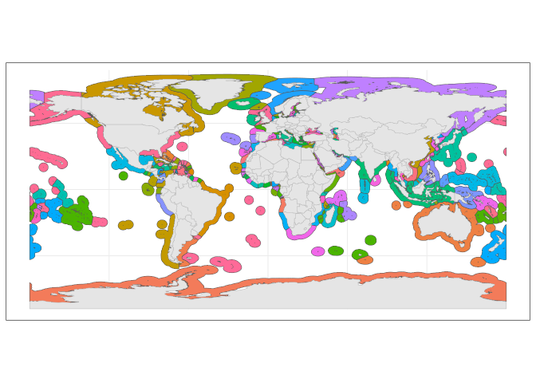
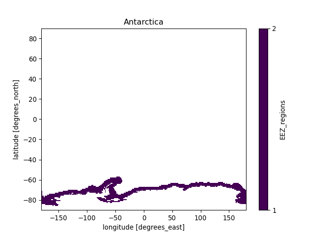

Creating raster mask from EEZs of the world shapefile
================
Denisse Fierro Arcos
2022-11-07

-   <a href="#introduction" id="toc-introduction">Introduction</a>
-   <a href="#loading-r-libraries" id="toc-loading-r-libraries">Loading R
    libraries</a>
-   <a href="#loading-shapefiles" id="toc-loading-shapefiles">Loading
    shapefiles</a>
-   <a href="#plotting-fao-regions-shapefile"
    id="toc-plotting-fao-regions-shapefile">Plotting FAO regions
    shapefile</a>
-   <a href="#extracting-names-and-codes-for-eez"
    id="toc-extracting-names-and-codes-for-eez">Extracting names and codes
    for EEZ</a>
-   <a href="#creating-a-multilayer-raster-mask-based-on-merged-shapefile"
    id="toc-creating-a-multilayer-raster-mask-based-on-merged-shapefile">Creating
    a multilayer raster mask based on merged shapefile</a>
    -   <a href="#loading-input-rasters" id="toc-loading-input-rasters">Loading
        input rasters</a>
    -   <a href="#defining-function-to-create-rasters-from-shapefiles"
        id="toc-defining-function-to-create-rasters-from-shapefiles">Defining
        function to create rasters from shapefiles</a>
    -   <a href="#applying-function-to-list-containing-all-shapefiles"
        id="toc-applying-function-to-list-containing-all-shapefiles">Applying
        function to list containing all shapefiles</a>
-   <a href="#python-based-code"
    id="toc-python-based-code"><code>Python</code>-based code</a>
    -   <a href="#loading-libraries" id="toc-loading-libraries">Loading
        libraries</a>
    -   <a href="#loading-raster-using-xarray"
        id="toc-loading-raster-using-xarray">Loading raster using
        <code>xarray</code></a>
    -   <a href="#plotting-results" id="toc-plotting-results">Plotting
        results</a>

## Introduction

The EEZs the of the world shapefile came from
[VLIZ](https://doi.org/10.14284/386). Rasters are created in `R` and the
final details are done with `xarray` library for `Python`.

## Loading R libraries

``` r
library(sf)
library(raster)
library(tidyverse)
library(reticulate)
```

## Loading shapefiles

The original shapefile contained a couple of errors: 1. The country of
Mauritius appeared as both Mauritius and Republic of Mauritius, however
they both referred to the same country as their country code was the
same for both: MUS. 2. The United Kingdom appeared twice with two
different countries codes. GBR has been kept as the unique code to
represent this country.

The section below loads the file, selects a subset of columns of
interest and corrects the errors identified above.

``` r
#Load shapefile with EEZ
eez_world <- read_sf("../Data/World_EEZ_v11_20191118/eez_v11.shp") %>%
  #Subset of columns
  select(-c(MRGID, MRGID_TER1, MRGID_SOV1:ISO_TER1, MRGID_TER2:Y_1, ISO_SOV2:UN_TER3)) %>% 
  #Fixing issues with coding of countries
  mutate(SOVEREIGN1 = case_when(ISO_SOV1 == "MUS" ~ "Mauritius",
                                T ~ SOVEREIGN1),
         ISO_SOV1 = case_when(SOVEREIGN1 == "United Kingdom" ~ "GBR",
                              T ~ ISO_SOV1)) %>% 
  #Turning character columns into factors
  mutate_if(is.character, as.factor)

#We can check the results of the first two rows
head(eez_world, 2)
```

    ## Simple feature collection with 2 features and 6 fields
    ## Geometry type: MULTIPOLYGON
    ## Dimension:     XY
    ## Bounding box:  xmin: -173.7747 ymin: -17.55527 xmax: -10.93248 ymax: -4.537529
    ## Geodetic CRS:  WGS 84
    ## # A tibble: 2 × 7
    ##   GEONAME      POL_T…¹ SOVER…² MRGID…³ AREA_…⁴ ISO_S…⁵                  geometry
    ##   <fct>        <fct>   <fct>     <dbl>   <dbl> <fct>          <MULTIPOLYGON [°]>
    ## 1 American Sa… 200NM   United…    8444  405830 USA     (((-166.6411 -17.55527, …
    ## 2 Ascension E… 200NM   United…    8379  446005 GBR     (((-10.93328 -7.887451, …
    ## # … with abbreviated variable names ¹​POL_TYPE, ²​SOVEREIGN1, ³​MRGID_EEZ,
    ## #   ⁴​AREA_KM2, ⁵​ISO_SOV1

## Plotting FAO regions shapefile

``` r
#Loading land shapefile to include in plot
land <- rnaturalearth::ne_countries(type = "countries", returnclass = "sf")

#Plotting FAO shapefile
eez_world %>% 
  ggplot()+
  geom_sf(aes(fill = SOVEREIGN1))+
  geom_sf(data = land, inherit.aes = F, color = "gray")+
  theme_bw()+
  theme(legend.position = "none")
```

<!-- -->

## Extracting names and codes for EEZ

We will use this information to save correct names for regions in the
raster

``` r
#Create a data frame of unique FAO regions
eez_names_codes <-  eez_world %>% 
  group_by(SOVEREIGN1) %>% 
  group_keys()

#We can check some of the results
head(eez_names_codes, 2)
```

    ## # A tibble: 2 × 1
    ##   SOVEREIGN1
    ##   <fct>     
    ## 1 Albania   
    ## 2 Algeria

## Creating a multilayer raster mask based on merged shapefile

We will now create multilayer mask, which match the resolution of the
model forcings (1 deg). First, we will load the sample rasters.

### Loading input rasters

``` r
#Loading 1 deg raster to be used as target for rasterising FAO regions
deg1 <- raster("../Data/InputRasters/gfdl-mom6-cobalt2_obsclim_deptho_onedeg_global_fixed.nc")
```

    ## Loading required namespace: ncdf4

``` r
#Sample from DBPM model
#deg1 <- raster("../Data/dbpm_ipsl-cm6a-lr_nobasd_historical_nat_default_tcb_global_monthly_1850_2014.nc")[[1]]

#Plotting raster
plot(deg1)
```

<!-- -->
\### Calculate grid area The `raster` package allows us to calculate the
area of grid cells in $km^2$ in just one line of code. We can save this
to calculate weighted means by area. We will use the raster above as a
base, and we will save the result on our disk.

``` r
#Calculating grid area
deg_area <- area(deg1)

#Saving results
writeRaster(deg_area, "../Data/InputRasters/area_1deg.nc", format = "CDF", overwrite = T, 
            #We will save the variable names so they match the Fish-MIP models
            varname = "area", xname = "lon", yname = "lat", varunit = "km2")
```

### Defining function to create rasters from shapefiles

We will define our own function that will use the shapefiles above to
create rasters.

``` r
#Defining function which needs a shapefile and a raster as input
shp_to_raster <- function(shp, nc_raster){
  #The final raster will have ones where within the shapefile boundaries
  rasterize(shp, nc_raster, field = 1)
}
```

### Applying function to list containing all shapefiles

``` r
#Split shapefile into regions prior to transforming into raster
eez_list <- eez_world %>% 
  group_by(SOVEREIGN1) %>% 
  group_split()

#Applying function to raster list
deg1_raster <- map(eez_list, shp_to_raster, deg1) %>% 
  #Stacking rasters to create a single multilayer raster
  stack()

#Checking results of stacked raster (first six regions)...
plot(deg1_raster[[1:6]])
```

<!-- -->

``` r
#Saving raster to disk
writeRaster(deg1_raster, "../Data/Masks/EEZ-world_1degmask_DBPM.nc", format = "CDF", overwrite = T,
            varname = "EEZ_regions", zname = "Country_EEZ")
```

# `Python`-based code

We will now start `Python` and save the correct names for the FAO
regions in the `netcdf` file we created in `R`.

``` r
#Activating conda
use_condaenv(Sys.getenv("RETICULATE_PYTHON"))
```

## Loading libraries

``` python
import xarray as xr
```

    ## C:\Users\ldfierro\AppData\Roaming\Python\Python38\site-packages\scipy\__init__.py:138: UserWarning: A NumPy version >=1.16.5 and <1.23.0 is required for this version of SciPy (detected version 1.23.2)
    ##   warnings.warn(f"A NumPy version >={np_minversion} and <{np_maxversion} is required for this version of "

``` python
import numpy as np
import matplotlib.pyplot as plt
import pandas as pd
```

## Loading raster using `xarray`

``` python
#Loading multilayer raster as dataset
mask = xr.open_dataset("../Data/Masks/EEZ-world_1degmask_DBPM.nc")
#Checking saved file in R
mask
```

    ## <xarray.Dataset>
    ## Dimensions:      (longitude: 360, latitude: 180, Country_EEZ: 157)
    ## Coordinates:
    ##   * longitude    (longitude) float64 -180.0 -179.0 -178.0 ... 177.0 178.0 179.0
    ##   * latitude     (latitude) float64 89.5 88.5 87.5 86.5 ... -87.5 -88.5 -89.5
    ##   * Country_EEZ  (Country_EEZ) int32 1 2 3 4 5 6 7 ... 152 153 154 155 156 157
    ## Data variables:
    ##     crs          int32 ...
    ##     EEZ_regions  (Country_EEZ, latitude, longitude) float32 ...
    ## Attributes:
    ##     Conventions:  CF-1.4
    ##     created_by:   R, packages ncdf4 and raster (version 3.5-29)
    ##     date:         2022-11-08 10:26:51

Here we can see that the FAO region names are not saved correctly. They
are numbered based on its location on the shapefile. We can update this
using the data frame with the unique FAO regions we previously created.

``` python
#We can simply load the data frame from the R environment.
eez_keys = r.eez_names_codes

#Checking list
eez_keys
```

    ##               SOVEREIGN1
    ## 0                Albania
    ## 1                Algeria
    ## 2                 Angola
    ## 3             Antarctica
    ## 4    Antigua and Barbuda
    ## ..                   ...
    ## 152              Vanuatu
    ## 153            Venezuela
    ## 154              Vietnam
    ## 155       Western Sahara
    ## 156                Yemen
    ## 
    ## [157 rows x 1 columns]

We can now update the names on the `netcdf` file.

``` python
#We will use the values in the data frame we loaded above
new_mask = []
for i, j in enumerate(mask.EEZ_regions):
  new_mask.append(j.drop('Country_EEZ').expand_dims({'Country': [eez_keys.SOVEREIGN1.iloc[i]]}))

new_mask = xr.concat(new_mask, dim = 'Country').to_dataset()
new_mask = new_mask.rename({'latitude': 'lat', 'longitude': 'lon'})
```

## Plotting results

We will plot all regions below to ensure we got them all correctly.

``` python
#We will loop through the first five to check results
for reg in new_mask.EEZ_regions[0:5]:
  #Plotting results
  fig = plt.figure()
  ax = fig.add_subplot(111)
  reg.plot(ax = ax, levels = [1, 2])
  plt.title(reg.Country.values.tolist())
  plt.show()
```

<!-- --><!-- --><!-- --><!-- --><!-- --><!-- -->
When comparing to the shapefile plots in the `R` section of this
notebook, we can see that the regions are named correctly. This means
that we can save our results now.

``` python
new_mask.to_netcdf("../Data/Masks/EEZ-world-corrected_1degmask_DBPM.nc")
```
