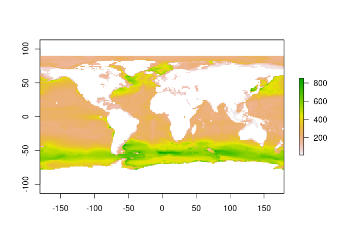
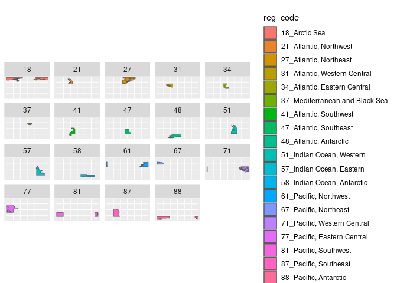
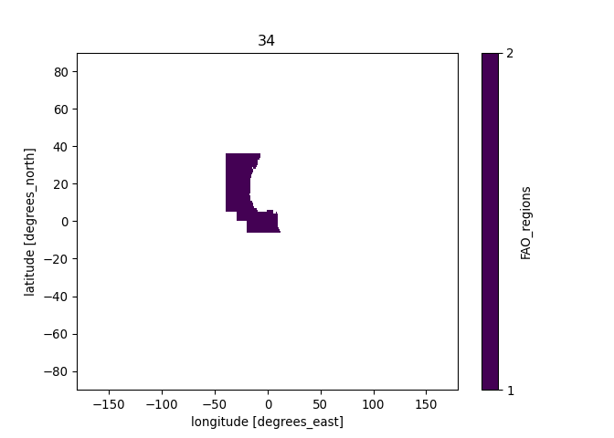
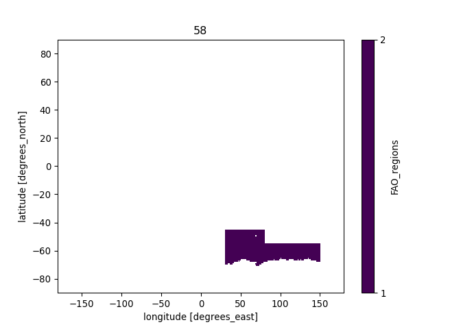
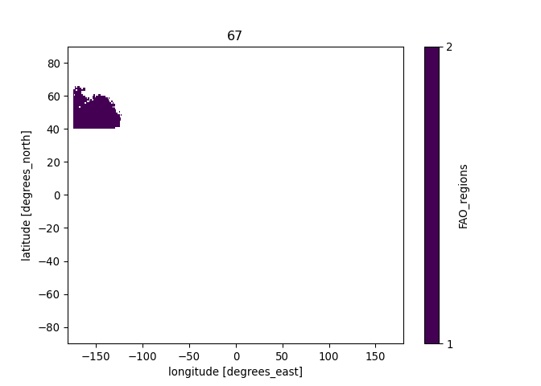
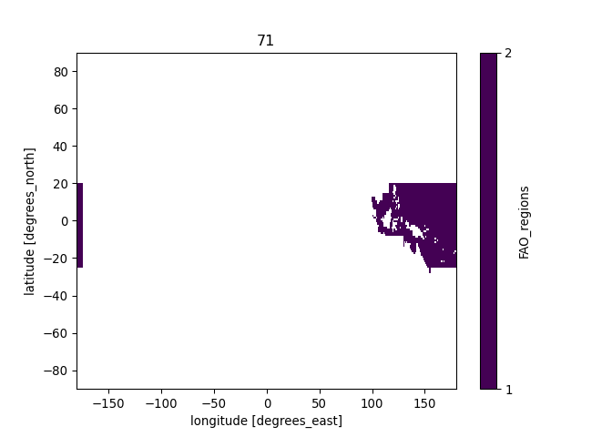
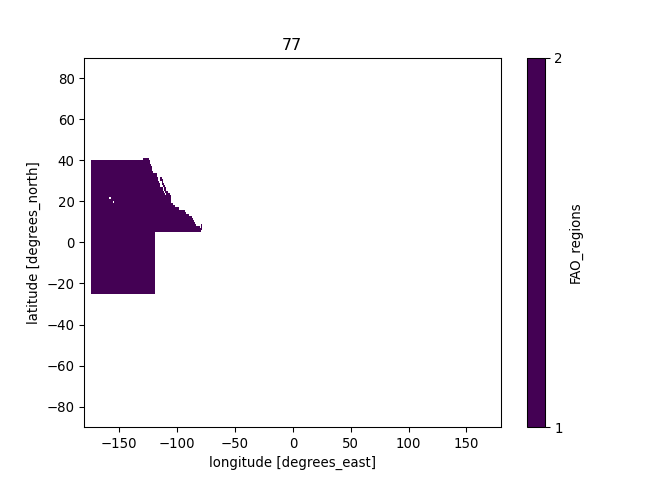
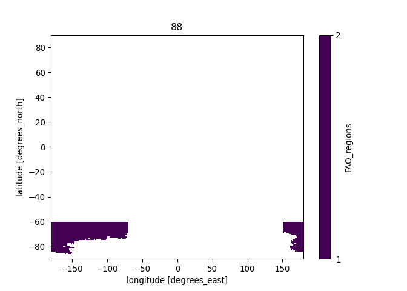

Creating raster mask from FAO regions shapefile
================
Denisse Fierro Arcos
2022-11-07

- <a href="#introduction" id="toc-introduction">Introduction</a>
- <a href="#loading-r-libraries" id="toc-loading-r-libraries">Loading R
  libraries</a>
- <a href="#loading-shapefiles" id="toc-loading-shapefiles">Loading
  shapefiles</a>
- <a href="#plotting-fao-regions-shapefile"
  id="toc-plotting-fao-regions-shapefile">Plotting FAO regions
  shapefile</a>
- <a href="#extracting-names-and-codes-for-fao-regions"
  id="toc-extracting-names-and-codes-for-fao-regions">Extracting names and
  codes for FAO regions</a>
- <a href="#creating-a-multilayer-raster-mask-based-on-merged-shapefile"
  id="toc-creating-a-multilayer-raster-mask-based-on-merged-shapefile">Creating
  a multilayer raster mask based on merged shapefile</a>
  - <a href="#loading-input-rasters" id="toc-loading-input-rasters">Loading
    input rasters</a>
  - <a href="#defining-function-to-create-rasters-from-shapefiles"
    id="toc-defining-function-to-create-rasters-from-shapefiles">Defining
    function to create rasters from shapefiles</a>
  - <a href="#applying-function-to-list-containing-all-shapefiles"
    id="toc-applying-function-to-list-containing-all-shapefiles">Applying
    function to list containing all shapefiles</a>
- <a href="#python-based-code"
  id="toc-python-based-code"><code>Python</code>-based code</a>
  - <a href="#loading-libraries" id="toc-loading-libraries">Loading
    libraries</a>
  - <a href="#loading-raster-using-xarray"
    id="toc-loading-raster-using-xarray">Loading raster using
    <code>xarray</code></a>
  - <a href="#plotting-results" id="toc-plotting-results">Plotting
    results</a>

## Introduction

This notebook will go through the process of creating a raster mask of
the FAO major fishing areas available through its [WFS
service](https://www.fao.org/fishery/geoserver/fifao/ows?service=WFS&request=GetFeature&version=1.0.0&typeName=fifao:FAO_AREAS_CWP).
Rasters are created in `R` and the final details are done with `xarray`
library for `Python`.

## Loading R libraries

``` r
library(sf)
library(raster)
library(tidyverse)
library(reticulate)
```

    ## Warning: package 'reticulate' was built under R version 4.2.2

## Loading shapefiles

A copy of the FAO Major Fishing Areas was saved locally from the [FAO’s
WFS
service](https://www.fao.org/fishery/geoserver/fifao/ows?service=WFS&request=GetFeature&version=1.0.0&typeName=fifao:FAO_AREAS_CWP).

``` r
#Load shapefile with FAO regions
fao_reg <- read_sf("../Spatial_Data/FAO_shapefiles/FAO_MajorAreas.shp") %>% 
  #Subset of columns
  select(-c(F_LEVEL, F_STATUS, SUBOCEAN:F_SUBUNIT, NAME_FR:SURFACE)) %>% 
  #Turning character columns into factors
  mutate_if(is.character, as.factor)

#We can check the results of the first two rows
head(fao_reg, 2)
```

    ## Simple feature collection with 2 features and 3 fields
    ## Geometry type: POLYGON
    ## Dimension:     XY
    ## Bounding box:  xmin: -180 ymin: 35.7829 xmax: 126.5826 ymax: 89.99
    ## Geodetic CRS:  WGS 84
    ## # A tibble: 2 × 4
    ##   F_CODE OCEAN   NAME_EN                                                geometry
    ##   <fct>  <fct>   <fct>                                             <POLYGON [°]>
    ## 1 18     Arctic  Arctic Sea         ((-40 89.99, -40 83.2997, -40.0028 83.2998,…
    ## 2 61     Pacific Pacific, Northwest ((126.5826 35.7829, 126.5825 35.7829, 126.5…

## Plotting FAO regions shapefile

``` r
#Loading land shapefile to include in plot
land <- rnaturalearth::ne_countries(type = "countries", returnclass = "sf")
#Plotting FAO shapefile
fao_reg %>% 
  ggplot()+
  geom_sf(aes(fill = NAME_EN))+
  geom_sf(data = land, inherit.aes = F, color = "gray")+
  theme_bw()
```

<!-- -->

## Extracting names and codes for FAO regions

We will use this information to save correct names for regions in the
raster

``` r
#Create a data frame of unique FAO regions
fao_names_codes <- fao_reg %>% 
  #Tranforming into data frame
  st_drop_geometry() %>% 
  #Extracting unique regions
  distinct(F_CODE, NAME_EN) %>% 
  #Ordering by region code
  arrange(F_CODE) %>% 
  #Fixing up names to use as raster layer name
  mutate_all(as.character) %>% 
  #Removing any spaces and commas from names and replacing with an underscore "_"
  mutate(NAME_EN = str_remove(string = NAME_EN, pattern = ","), 
         NAME_EN = str_replace_all(NAME_EN, " ", "_"))

#We can check some of the results
head(fao_names_codes, 2)
```

    ## # A tibble: 2 × 2
    ##   F_CODE NAME_EN           
    ##   <chr>  <chr>             
    ## 1 18     Arctic_Sea        
    ## 2 21     Atlantic_Northwest

``` r
#Saving FAO region keys
fao_names_codes %>% 
  write_csv("../Spatial_Data/FAO_shapefiles/FAO-regions_keys.csv")
```

## Creating a multilayer raster mask based on merged shapefile

We will now create a multilayer mask that matches the grid used in the
physical model forcings. Most models use the same 1 degree grid, with
the exception of the DBPM ecosystem model, which uses a different 1
degree grid, and the DBEM model, which uses a 0.5 degree grid.

Note that masks *must* match the grid of the model from which data is
being extracted. This means that you will need to create a new mask for
each grid that is different. In the chunk below, you will find the three
different grids identified in the ecosystem models.

### Loading input rasters

``` r
#Loading sample raster to be used as target for rasterising FAO regions
#Most ecosystem models use this one degree grid
# ras <- raster("../Spatial_Data/InputRasters/gfdl-mom6-cobalt2_obsclim_deptho_onedeg_global_fixed.nc")

#Sample from DBPM model
ras <- raster("../Spatial_Data/InputRasters/dbpm_ipsl-cm6a-lr_nobasd_historical_nat_default_tcb_global_monthly_1850_2014.nc")[[1]]
```

    ## Loading required namespace: ncdf4

``` r
#Sample from DBEM model
# ras <- raster("../Spatial_Data/InputRasters/dbem_ipsl-cm6a-lr_nobasd_historical_nat_default_tcb_global_annual_1951_2014.nc")[[1]]

#We will define a few extra variables to automate creation of file names for each mask
#Model resolution
res <- "1deg"

#Model associated with grid. Leave blank if multiple models use same grid
mod_name <- "_DBPM"

#Plotting raster
plot(ras)
```

<!-- -->

### Defining function to create rasters from shapefiles

We will define our own function that will use the shapefiles above to
create rasters.

``` r
#Defining function which needs a shapefile and a raster as input
shp_to_raster <- function(shp, nc_raster){
  #The final raster will have ones where within the shapefile boundaries
  rasterize(shp, nc_raster, field = 1)
}
```

### Applying function to list containing all shapefiles

``` r
#Split shapefile into regions prior to transforming into raster
fao_reg_list <- fao_reg %>% 
  group_by(F_CODE) %>% 
  group_split()

#Applying function to raster list
grid_raster <- map(fao_reg_list, shp_to_raster, ras) %>% 
  #Stacking rasters to create a single multilayer raster
  stack()

#Checking results of stacked raster (first six regions)...
plot(grid_raster[[1:6]])
```

<!-- -->
We will plot the shapefile to compare results.

``` r
#...against shapefile, to make sure they match
fao_reg %>% 
  #Creating a new column with the code and name to identify them easily in graph
  unite("reg_code", F_CODE, NAME_EN, remove = F) %>% 
  ggplot()+
  geom_sf(aes(fill = reg_code))+
  facet_wrap(~F_CODE)
```

<!-- -->
The results match! We can now save the results locally and move onto
`Python` for the final touches.

``` r
#Define file name
filename <- paste0("FAO-regions_", res, "mask", mod_name, ".nc")

#Saving raster to disk
writeRaster(grid_raster, file.path("../Spatial_Data/Masks", filename), format = "CDF", overwrite = T,
            varname = "FAO_regions", zname = "FAO_reg_name")
```

# `Python`-based code

We will now start `Python` and save the correct names for the FAO
regions in the `netcdf` file we created in `R`.

``` r
#Activating conda
use_condaenv("CMIP6_data")
```

## Loading libraries

``` python
import xarray as xr
import numpy as np
import matplotlib.pyplot as plt
import pandas as pd
import os
```

## Loading raster using `xarray`

``` python
#Getting filename
fn = f'FAO-regions_{r.res}mask{r.mod_name}.nc'

#Loading multilayer raster as dataset
mask = xr.open_dataset(os.path.join('../Spatial_Data/Masks', fn))
#Checking saved file in R
mask
```

    ## <xarray.Dataset>
    ## Dimensions:       (longitude: 360, latitude: 180, FAO_reg_name: 19)
    ## Coordinates:
    ##   * longitude     (longitude) float64 -180.0 -179.0 -178.0 ... 177.0 178.0 179.0
    ##   * latitude      (latitude) float64 89.5 88.5 87.5 86.5 ... -87.5 -88.5 -89.5
    ##   * FAO_reg_name  (FAO_reg_name) int32 1 2 3 4 5 6 7 8 ... 13 14 15 16 17 18 19
    ## Data variables:
    ##     crs           int32 ...
    ##     FAO_regions   (FAO_reg_name, latitude, longitude) float32 ...
    ## Attributes:
    ##     Conventions:  CF-1.4
    ##     created_by:   R, packages ncdf4 and raster (version 3.5-29)
    ##     date:         2022-12-15 19:36:13

Here we can see that the FAO region names are not saved correctly. They
are numbered based on its location on the shapefile. We can update this
using the data frame with the unique FAO regions we previously created.

``` python
#We can simply load the data frame from the R environment.
FAO_keys = r.fao_names_codes

#We could also load it from our disk using the line below.
#FAO_keys = pd.read_csv("../Spatial_Data/FAO_shapefiles/FAO-regions_keys.csv")

#Checking list
FAO_keys
```

    ##    F_CODE                      NAME_EN
    ## 0      18                   Arctic_Sea
    ## 1      21           Atlantic_Northwest
    ## 2      27           Atlantic_Northeast
    ## 3      31     Atlantic_Western_Central
    ## 4      34     Atlantic_Eastern_Central
    ## 5      37  Mediterranean_and_Black_Sea
    ## 6      41           Atlantic_Southwest
    ## 7      47           Atlantic_Southeast
    ## 8      48           Atlantic_Antarctic
    ## 9      51         Indian_Ocean_Western
    ## 10     57         Indian_Ocean_Eastern
    ## 11     58       Indian_Ocean_Antarctic
    ## 12     61            Pacific_Northwest
    ## 13     67            Pacific_Northeast
    ## 14     71      Pacific_Western_Central
    ## 15     77      Pacific_Eastern_Central
    ## 16     81            Pacific_Southwest
    ## 17     87            Pacific_Southeast
    ## 18     88            Pacific_Antarctic

We can now update the names on the `netcdf` file.

``` python
#We will use the values in the data frame we loaded above
mask['FAO_reg_name'] = FAO_keys.NAME_EN.tolist()

#Checking results
mask = mask.rename({'latitude': 'lat', 'longitude': 'lon'})
```

## Plotting results

We will plot all regions below to ensure we got them all correctly.

``` python
#We will loop through each layer
for reg in mask.FAO_regions:
  #Plotting results
  fig = plt.figure()
  ax = fig.add_subplot(111)
  reg.plot(ax = ax, levels = [1, 2])
  plt.title(reg.FAO_reg_name.values.tolist())
  plt.show()
```

<!-- --><!-- --><!-- --><!-- --><!-- --><!-- --><!-- --><!-- --><!-- --><!-- --><!-- --><!-- --><!-- --><!-- --><!-- --><!-- --><!-- --><!-- --><!-- --><!-- -->
When comparing to the shapefile plots in the `R` section of this
notebook, we can see that the regions are named correctly. This means
that we can save our results now.

``` python
#Creating filename
fn = f'FAO-regions-corrected_{r.res}mask{r.mod_name}.nc'

#Saving result
mask.to_netcdf(os.path.join('../Spatial_Data/Masks', fn))
```
