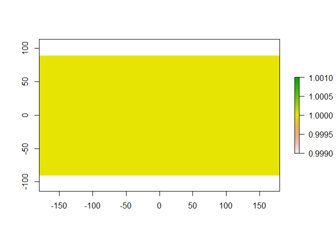
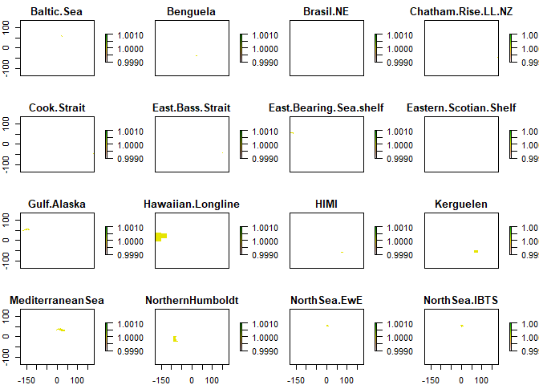

Creating your own mask from a shapefile
================
Denisse Fierro Arcos
2022-08-30

-   <a href="#introduction" id="toc-introduction">Introduction</a>
-   <a href="#loading-r-libraries" id="toc-loading-r-libraries">Loading R
    libraries</a>
-   <a href="#loading-shapefiles" id="toc-loading-shapefiles">Loading
    shapefiles</a>
    -   <a href="#getting-list-of-lme-names-from-directory-paths"
        id="toc-getting-list-of-lme-names-from-directory-paths">Getting list of
        LME names from directory paths</a>
    -   <a href="#getting-file-paths-for-shapefiles"
        id="toc-getting-file-paths-for-shapefiles">Getting file paths for
        shapefiles</a>
    -   <a href="#loading-regions" id="toc-loading-regions">Loading regions</a>
-   <a href="#plotting-merged-shapefile"
    id="toc-plotting-merged-shapefile">Plotting merged shapefile</a>
    -   <a href="#saving-lme-polygons-as-a-single-shapefile"
        id="toc-saving-lme-polygons-as-a-single-shapefile">Saving LME polygons
        as a single shapefile</a>
-   <a href="#creating-a-multilayer-raster-mask-based-on-merged-shapefile"
    id="toc-creating-a-multilayer-raster-mask-based-on-merged-shapefile">Creating
    a multilayer raster mask based on merged shapefile</a>
    -   <a href="#loading-input-rasters" id="toc-loading-input-rasters">Loading
        input rasters</a>
    -   <a href="#defining-function-to-create-rasters-from-shapefiles"
        id="toc-defining-function-to-create-rasters-from-shapefiles">Defining
        function to create rasters from shapefiles</a>
    -   <a href="#applying-function-to-list-containing-all-shapefiles"
        id="toc-applying-function-to-list-containing-all-shapefiles">Applying
        function to list containing all shapefiles</a>
    -   <a href="#saving-rasters-to-disk" id="toc-saving-rasters-to-disk">Saving
        rasters to disk</a>
-   <a href="#using-python-to-update-name-of-regions-in-netcdf-file"
    id="toc-using-python-to-update-name-of-regions-in-netcdf-file">Using
    Python to update name of regions in netcdf file</a>
    -   <a href="#checking-results-in-r" id="toc-checking-results-in-r">Checking
        results in R</a>
-   <a href="#extracting-data-with-multipolygon-feature"
    id="toc-extracting-data-with-multipolygon-feature">Extracting data with
    multipolygon feature</a>
-   <a href="#extract-data-from-raster"
    id="toc-extract-data-from-raster">Extract data from raster</a>
    -   <a href="#option-a-with-st_crop" id="toc-option-a-with-st_crop">Option A
        with <code>st_crop</code></a>
    -   <a href="#option-b-with-simple-mask"
        id="toc-option-b-with-simple-mask">Option B with simple mask</a>
-   <a href="#extracting-time-series"
    id="toc-extracting-time-series">Extracting time series</a>
-   <a href="#plotting-time-series" id="toc-plotting-time-series">Plotting
    time series</a>

## Introduction

This notebook will guide you through the steps of how to create a mask
using LME shapefiles used in the FishMIP project.

## Loading R libraries

``` r
library(sf)
library(raster)
library(tidyverse)
library(stars)
library(geobgu)
```

## Loading shapefiles

LME shapefiles included in the FishMIP project are included under the
`Data` folder. First, we will get the file paths for these shapefiles.

### Getting list of LME names from directory paths

``` r
#Getting the names of directories containing the shapefiles for different regions of interest
names_regions <- list.dirs(path = "../Data/Shapefiles_Regions/", recursive = F, 
                           full.names = F)

#Extracting the names from the directories
names_regions <- str_split_fixed(names_regions, "_", n = 2)[,1]
names_regions
```

    ##  [1] "Baltic-Sea"                "Benguela"                 
    ##  [3] "Brasil-NE"                 "Chatham-Rise-LL-NZ"       
    ##  [5] "Cook-Strait"               "East-Bass-Strait"         
    ##  [7] "East-Bearing-Sea-shelf"    "Eastern-Scotian-Shelf"    
    ##  [9] "Gulf-Alaska"               "Hawaiian-Longline"        
    ## [11] "HIMI"                      "Kerguelen"                
    ## [13] "MediterraneanSea"          "NorthernHumboldt"         
    ## [15] "NorthSea-EwE"              "NorthSea-IBTS"            
    ## [17] "Prydz-Bay"                 "SEAustralia-Atlantis"     
    ## [19] "SEAustralia-mizer"         "TaiwanCentralSouthPacific"
    ## [21] "Tasman-Golden-Bays-NZ"

### Getting file paths for shapefiles

``` r
#Getting file paths
regions_paths <- list.files(path = "../Data/Shapefiles_Regions/", pattern = ".shp$", 
                            recursive = T, full.names = T)

#Ignore any shapefiles included in the "SupportInfo" subfolder
regions_paths <- regions_paths[!str_detect(regions_paths, "SupportInfo")]
regions_paths
```

    ##  [1] "../Data/Shapefiles_Regions//Baltic-Sea_Shapefiles/BalticSea_BordersClip.shp"                      
    ##  [2] "../Data/Shapefiles_Regions//Benguela_shapefiles/model_regions_v3_geo.shp"                         
    ##  [3] "../Data/Shapefiles_Regions//Brasil-NE_regional_Model/BRA_NE_Model.shp"                            
    ##  [4] "../Data/Shapefiles_Regions//Chatham-Rise-LL-NZ_Mizer/CHAT30_LL.shp"                               
    ##  [5] "../Data/Shapefiles_Regions//Cook-Strait_EwE_shapefiles/CookStrait_BordersClip.shp"                
    ##  [6] "../Data/Shapefiles_Regions//East-Bass-Strait_EwE/bulman_region.shp"                               
    ##  [7] "../Data/Shapefiles_Regions//East-Bearing-Sea-shelf_subregions10_60/EBS_subregions10_60.shp"       
    ##  [8] "../Data/Shapefiles_Regions//Eastern-Scotian-Shelf_mizer/ESS_200m_withgully.shp"                   
    ##  [9] "../Data/Shapefiles_Regions//Gulf-Alaska_mizer/GOA.shp"                                            
    ## [10] "../Data/Shapefiles_Regions//Hawaiian-Longline_region/HawaiianLongline_BordersClip.shp"            
    ## [11] "../Data/Shapefiles_Regions//HIMI_mizer_model/HIMI_BordersClip.shp"                                
    ## [12] "../Data/Shapefiles_Regions//Kerguelen_shapefiles/Ecopath_model_domain_curved.shp"                 
    ## [13] "../Data/Shapefiles_Regions//MediterraneanSea_shapefiles/lme.shp"                                  
    ## [14] "../Data/Shapefiles_Regions//NorthernHumboldt_OSMOSE/NorthHumboldt_Borders.shp"                    
    ## [15] "../Data/Shapefiles_Regions//NorthSea-EwE_shapefiles/NorthSeaEwe_Borders.shp"                      
    ## [16] "../Data/Shapefiles_Regions//NorthSea-IBTS_mizer/Shapefile.shp"                                    
    ## [17] "../Data/Shapefiles_Regions//Prydz-Bay_mizer/Prydz_Bay.shp"                                        
    ## [18] "../Data/Shapefiles_Regions//SEAustralia-Atlantis_shapefiles/Atlantis_SE_boundary_box.shp"         
    ## [19] "../Data/Shapefiles_Regions//SEAustralia-mizer_shapefiles/sess_cts.shp"                            
    ## [20] "../Data/Shapefiles_Regions//TaiwanCentralSouthPacific_mizer/TaiwanCentralSouthPacific_Borders.shp"
    ## [21] "../Data/Shapefiles_Regions//Tasman-Golden-Bays-NZ_Mizer/P0to26_depth.shp"

### Loading regions

We must first ensure that all shapefiles are in the same coordinate
reference system (CRS) prior to creating a single shapefile. We will
load each shapefile into a list and change the CRS if necessary. We are
also making sure that any shapefiles that cross the international
dateline are shown correctly when WGS84 CRS (EPSG:4326) is assigned.

``` r
#Switching off spherical geometry prior to accessing and cropping world shapefile
sf_use_s2(F)
```

    ## Spherical geometry (s2) switched off

``` r
#Create empty list to store shapefiles
AOI_list <- list()

for(i in seq_along(regions_paths)){
  #Load original shapefile
  reg_raw <- read_sf(regions_paths[i]) %>%
    mutate(region = names_regions[i])
  #Check shapefile CRS. If none assigned and geometry is between -180 and +180, then assign WGS84
  if(st_crs(reg_raw) == "" | is.na(st_crs(reg_raw)) | is.null(st_crs(reg_raw))){
    if(sum(reg_raw$geometry[[1]][[1]] > 180) == F & sum(reg_raw$geometry[[1]][[1]] < -180) == F){
      st_crs(reg_raw) <- 4326}
    #If the shapefile has a CRS different to 4326, then transform it to WGS84
    }else if(st_crs(reg_raw) != st_crs(4326)){
      reg_raw <- st_transform(reg_raw, 4326)
    }
  
  #Remove internal region boundaries
  reg_raw <- reg_raw %>% 
    #Make sure it wraps around the international dateline
    st_wrap_dateline(options = c("WRAPDATELINE=YES", "DATELINEOFFSET=180")) %>% 
    group_by(region) %>% 
    summarise() %>% 
    #Ensure there are only two dimensions
    st_zm()
  
  #Make sure final area is polygon only
  if(unique(st_geometry_type(reg_raw)) != "POLYGON"){
    reg_raw <- st_cast(reg_raw, "POLYGON", do_split = F)
  }
  
  #Saving shapefiles in empty list
  AOI_list[[names_regions[i]]] <- reg_raw
}
```

    ## although coordinates are longitude/latitude, st_union assumes that they are planar

    ## Warning in st_cast.MULTIPOLYGON(X[[i]], ...): polygon from first part only

    ## although coordinates are longitude/latitude, st_union assumes that they are planar

    ## although coordinates are longitude/latitude, st_union assumes that they are planar
    ## although coordinates are longitude/latitude, st_union assumes that they are planar

    ## Warning in st_cast.MULTIPOLYGON(X[[i]], ...): polygon from first part only

    ## although coordinates are longitude/latitude, st_union assumes that they are planar
    ## although coordinates are longitude/latitude, st_union assumes that they are planar
    ## although coordinates are longitude/latitude, st_union assumes that they are planar
    ## although coordinates are longitude/latitude, st_union assumes that they are planar
    ## although coordinates are longitude/latitude, st_union assumes that they are planar

    ## Warning in st_cast.MULTIPOLYGON(X[[i]], ...): polygon from first part only

    ## although coordinates are longitude/latitude, st_union assumes that they are planar
    ## although coordinates are longitude/latitude, st_union assumes that they are planar
    ## although coordinates are longitude/latitude, st_union assumes that they are planar
    ## although coordinates are longitude/latitude, st_union assumes that they are planar
    ## although coordinates are longitude/latitude, st_union assumes that they are planar
    ## although coordinates are longitude/latitude, st_union assumes that they are planar

    ## Warning in st_cast.MULTIPOLYGON(X[[i]], ...): polygon from first part only

    ## although coordinates are longitude/latitude, st_union assumes that they are planar

    ## Warning in st_cast.MULTIPOLYGON(X[[i]], ...): polygon from first part only

    ## although coordinates are longitude/latitude, st_union assumes that they are planar
    ## although coordinates are longitude/latitude, st_union assumes that they are planar
    ## although coordinates are longitude/latitude, st_union assumes that they are planar
    ## although coordinates are longitude/latitude, st_union assumes that they are planar
    ## although coordinates are longitude/latitude, st_union assumes that they are planar

Now that all shapefiles are in the same CRS, we can create a single
shapefile for all LME regions.

``` r
RMEs <- AOI_list %>% 
  bind_rows()
```

## Plotting merged shapefile

``` r
#We will load a world map for reference
land <- rnaturalearth::ne_countries(type = "countries", returnclass = "sf")

#Plotting LMEs over world map
RMEs %>% 
  ggplot()+
  geom_sf(aes(fill = region))+
  geom_sf(data = land, inherit.aes = F, color = "gray")+
  theme_bw()
```

<!-- -->

### Saving LME polygons as a single shapefile

``` r
st_write(RMEs, "../Data/Masks/FishMIP_RMEs_all.shp", append = F)
```

    ## Deleting layer `FishMIP_RMEs_all' using driver `ESRI Shapefile'
    ## Writing layer `FishMIP_RMEs_all' to data source 
    ##   `../Data/Masks/FishMIP_RMEs_all.shp' using driver `ESRI Shapefile'
    ## Writing 21 features with 1 fields and geometry type Polygon.

## Creating a multilayer raster mask based on merged shapefile

We will now create multilayer masks at two resolutions: one degree and
0.25 degrees, which match the resolution of the model forcings. We will
first load sample rasters at these two resolutions.

### Loading input rasters

``` r
deg025 <- raster("../Data/InputRasters/gfdl-mom6-cobalt2_obsclim_deptho_15arcmin_global_fixed.nc")
```

    ## Loading required namespace: ncdf4

``` r
deg1 <- raster("../Data/InputRasters/gfdl-mom6-cobalt2_obsclim_deptho_onedeg_global_fixed.nc")

#Plotting raster
plot(deg1)
```

<!-- -->

### Defining function to create rasters from shapefiles

We will define our own function that will use the shapefiles above to
create rasters.

``` r
#Defining function which needs a shapefile and a raster as input
shp_to_raster <- function(shp, nc_raster){
  #If needed, sf shapefiles can be transformed into Spatial objects
  # shp <- as(shp, "Spatial")
  #The final raster will have ones where within the shapefile boundaries
  rasterize(shp, nc_raster, field = 1)
}
```

### Applying function to list containing all shapefiles

``` r
#Applying function defined above to all shapefiles within list
deg1_raster <- map(AOI_list, shp_to_raster, deg1)
deg025_raster <- map(AOI_list, shp_to_raster, deg025)

#Stacking rasters to create a single multilayer raster for each resolution
deg1_raster <- stack(deg1_raster)
deg025_raster <- stack(deg025_raster)
```

### Saving rasters to disk

``` r
# writeRaster(deg025_raster, "../Data/Masks/fishMIP_regional_025mask_ISIMIP3a.nc", format = "CDF", overwrite = T,
#             xname = "Longitude", yname = "Latitude", varname = "RegionMask", varunit = "binary",
#             longname = "Region Mask -- True or False", zname = "Region")
# 
# writeRaster(deg1_raster, "../Data/Masks/fishMIP_regional_1mask_ISIMIP3a.nc", format = "CDF", overwrite = T, 
#             xname = "Longitude", yname = "Latitude", varname = "RegionMask", varunit = "binary",
#             longname = "Region Mask -- True or False", zname = "Region")
```

## Using Python to update name of regions in netcdf file

``` r
library(reticulate)
python_path <- as.character(Sys.which("python"))
use_python(python_path)
```

``` python
#Loading xarray library to open netcdf file
import xarray as xr

#Open stacked rasters
```

    ## C:\Users\ldfierro\AppData\Roaming\Python\Python38\site-packages\scipy\__init__.py:138: UserWarning: A NumPy version >=1.16.5 and <1.23.0 is required for this version of SciPy (detected version 1.23.2)
    ##   warnings.warn(f"A NumPy version >={np_minversion} and <{np_maxversion} is required for this version of "

``` python
deg1 = xr.open_dataset("../Data/Masks/fishMIP_regional_1mask_ISIMIP3a.nc")
deg025 = xr.open_dataset("../Data/Masks/fishMIP_regional_025mask_ISIMIP3a.nc")

RME_names = r.names_regions

#Create an empty dictionary
RME_mask1deg = []
RME_mask025deg = []

#Loop through each dictionary entry
for da1deg, da025deg, rme in zip(deg1.RegionMask, deg025.RegionMask, RME_names):
  da1deg = da1deg.drop_vars("Region")
  da025deg = da025deg.drop_vars("Region")
  #Adding dimension with LME name
  RME_mask1deg.append(da1deg.expand_dims(RME_name = [rme]))
  RME_mask025deg.append(da025deg.expand_dims(RME_name = [rme]))

#Creating multidimensional dataset
RME_mask1deg = xr.concat(RME_mask1deg, dim = 'RME_name')
RME_mask025deg = xr.concat(RME_mask025deg, dim = 'RME_name')

#Check results
RME_mask1deg; RME_mask025deg

# RME_mask1deg.to_netcdf("../Data/Masks/fishMIP_regional_1degmask_ISIMIP3a.nc", mode = 'w')
# RME_mask025deg.to_netcdf("../Data/Masks/fishMIP_regional_025degmask_ISIMIP3a.nc", mode = 'w')
```

    ## <xarray.DataArray 'RegionMask' (RME_name: 21, Latitude: 180, Longitude: 360)>
    ## array([[[nan, nan, nan, ..., nan, nan, nan],
    ##         [nan, nan, nan, ..., nan, nan, nan],
    ##         [nan, nan, nan, ..., nan, nan, nan],
    ##         ...,
    ##         [nan, nan, nan, ..., nan, nan, nan],
    ##         [nan, nan, nan, ..., nan, nan, nan],
    ##         [nan, nan, nan, ..., nan, nan, nan]],
    ## 
    ##        [[nan, nan, nan, ..., nan, nan, nan],
    ##         [nan, nan, nan, ..., nan, nan, nan],
    ##         [nan, nan, nan, ..., nan, nan, nan],
    ##         ...,
    ##         [nan, nan, nan, ..., nan, nan, nan],
    ##         [nan, nan, nan, ..., nan, nan, nan],
    ##         [nan, nan, nan, ..., nan, nan, nan]],
    ## 
    ##        [[nan, nan, nan, ..., nan, nan, nan],
    ##         [nan, nan, nan, ..., nan, nan, nan],
    ##         [nan, nan, nan, ..., nan, nan, nan],
    ##         ...,
    ## ...
    ##         ...,
    ##         [nan, nan, nan, ..., nan, nan, nan],
    ##         [nan, nan, nan, ..., nan, nan, nan],
    ##         [nan, nan, nan, ..., nan, nan, nan]],
    ## 
    ##        [[nan, nan, nan, ..., nan, nan, nan],
    ##         [nan, nan, nan, ..., nan, nan, nan],
    ##         [nan, nan, nan, ..., nan, nan, nan],
    ##         ...,
    ##         [nan, nan, nan, ..., nan, nan, nan],
    ##         [nan, nan, nan, ..., nan, nan, nan],
    ##         [nan, nan, nan, ..., nan, nan, nan]],
    ## 
    ##        [[nan, nan, nan, ..., nan, nan, nan],
    ##         [nan, nan, nan, ..., nan, nan, nan],
    ##         [nan, nan, nan, ..., nan, nan, nan],
    ##         ...,
    ##         [nan, nan, nan, ..., nan, nan, nan],
    ##         [nan, nan, nan, ..., nan, nan, nan],
    ##         [nan, nan, nan, ..., nan, nan, nan]]], dtype=float32)
    ## Coordinates:
    ##   * RME_name   (RME_name) object 'Baltic-Sea' ... 'Tasman-Golden-Bays-NZ'
    ##   * Longitude  (Longitude) float64 -179.5 -178.5 -177.5 ... 177.5 178.5 179.5
    ##   * Latitude   (Latitude) float64 89.5 88.5 87.5 86.5 ... -87.5 -88.5 -89.5
    ## Attributes:
    ##     units:         binary
    ##     long_name:     Region Mask -- True or False
    ##     grid_mapping:  crs
    ##     proj4:         +proj=longlat +datum=WGS84 +no_defs
    ##     min:           [ 1.  1.  1.  1.  1.  1.  1.  1.  1.  1.  1.  1.  1.  1.  ...
    ##     max:           [  1.   1.   1.   1.   1.   1.   1.   1.   1.   1.   1.   ...
    ## <xarray.DataArray 'RegionMask' (RME_name: 21, Latitude: 720, Longitude: 1440)>
    ## array([[[nan, nan, nan, ..., nan, nan, nan],
    ##         [nan, nan, nan, ..., nan, nan, nan],
    ##         [nan, nan, nan, ..., nan, nan, nan],
    ##         ...,
    ##         [nan, nan, nan, ..., nan, nan, nan],
    ##         [nan, nan, nan, ..., nan, nan, nan],
    ##         [nan, nan, nan, ..., nan, nan, nan]],
    ## 
    ##        [[nan, nan, nan, ..., nan, nan, nan],
    ##         [nan, nan, nan, ..., nan, nan, nan],
    ##         [nan, nan, nan, ..., nan, nan, nan],
    ##         ...,
    ##         [nan, nan, nan, ..., nan, nan, nan],
    ##         [nan, nan, nan, ..., nan, nan, nan],
    ##         [nan, nan, nan, ..., nan, nan, nan]],
    ## 
    ##        [[nan, nan, nan, ..., nan, nan, nan],
    ##         [nan, nan, nan, ..., nan, nan, nan],
    ##         [nan, nan, nan, ..., nan, nan, nan],
    ##         ...,
    ## ...
    ##         ...,
    ##         [nan, nan, nan, ..., nan, nan, nan],
    ##         [nan, nan, nan, ..., nan, nan, nan],
    ##         [nan, nan, nan, ..., nan, nan, nan]],
    ## 
    ##        [[nan, nan, nan, ..., nan, nan, nan],
    ##         [nan, nan, nan, ..., nan, nan, nan],
    ##         [nan, nan, nan, ..., nan, nan, nan],
    ##         ...,
    ##         [nan, nan, nan, ..., nan, nan, nan],
    ##         [nan, nan, nan, ..., nan, nan, nan],
    ##         [nan, nan, nan, ..., nan, nan, nan]],
    ## 
    ##        [[nan, nan, nan, ..., nan, nan, nan],
    ##         [nan, nan, nan, ..., nan, nan, nan],
    ##         [nan, nan, nan, ..., nan, nan, nan],
    ##         ...,
    ##         [nan, nan, nan, ..., nan, nan, nan],
    ##         [nan, nan, nan, ..., nan, nan, nan],
    ##         [nan, nan, nan, ..., nan, nan, nan]]], dtype=float32)
    ## Coordinates:
    ##   * RME_name   (RME_name) object 'Baltic-Sea' ... 'Tasman-Golden-Bays-NZ'
    ##   * Longitude  (Longitude) float64 -179.9 -179.6 -179.4 ... 179.4 179.6 179.9
    ##   * Latitude   (Latitude) float64 89.88 89.62 89.38 ... -89.38 -89.62 -89.88
    ## Attributes:
    ##     units:         binary
    ##     long_name:     Region Mask -- True or False
    ##     grid_mapping:  crs
    ##     proj4:         +proj=longlat +datum=WGS84 +no_defs
    ##     min:           [1. 1. 1. 1. 1. 1. 1. 1. 1. 1. 1. 1. 1. 1. 1. 1. 1. 1. 1. ...
    ##     max:           [1. 1. 1. 1. 1. 1. 1. 1. 1. 1. 1. 1. 1. 1. 1. 1. 1. 1. 1. ...

### Checking results in R

``` r
deg1 <- stack("../Data/Masks/fishMIP_regional_1degmask_ISIMIP3a.nc", varname = "RegionMask")
```

    ## [1] "vobjtovarid4: error #F: I could not find the requsted var (or dimvar) in the file!"
    ## [1] "var (or dimvar) name: crs"
    ## [1] "file name: C:\\Users\\ldfierro\\OneDrive - University of Tasmania\\FishMIP\\FishMIP_extracting-data\\Data\\Masks\\fishMIP_regional_1degmask_ISIMIP3a.nc"

``` r
deg025 <- stack("../Data/Masks/fishMIP_regional_025degmask_ISIMIP3a.nc", varname = "RegionMask")
```

    ## [1] "vobjtovarid4: error #F: I could not find the requsted var (or dimvar) in the file!"
    ## [1] "var (or dimvar) name: crs"
    ## [1] "file name: C:\\Users\\ldfierro\\OneDrive - University of Tasmania\\FishMIP\\FishMIP_extracting-data\\Data\\Masks\\fishMIP_regional_025degmask_ISIMIP3a.nc"

``` r
plot(deg1)
```

<!-- -->

## Extracting data with multipolygon feature

Finally, we will use the newly created shapefile to extract data for our
regions of interest.

``` r
#Getting file paths of raster with global total catch data
data_file <- list.files(path = "../Data/", pattern = ".*global.*nc$", full.names = T)

#Loading sample raster from disk
tc_raster <- read_stars(data_file)%>% 
  st_set_crs(st_crs(RMEs))

#Change name of variable for easier access to data
names(tc_raster) <- "tc"

max_val <- max(tc_raster$tc)

#Masking land values
tc_raster <- st_apply(tc_raster, "time", function(x) na_if(x, as.numeric(max_val)))
```

Plotting one time step as an example.

``` r
tc1 <- tc_raster %>%
  slice(index = 1, along = "time")
plot(tc1)
```

<!-- -->

## Extract data from raster

### Option A with `st_crop`

``` r
tc1_crop <- st_crop(tc1, RMEs)
```

    ## although coordinates are longitude/latitude, st_union assumes that they are planar

    ## although coordinates are longitude/latitude, st_intersects assumes that they are planar

``` r
plot(tc1_crop)
```

<!-- -->

### Option B with simple mask

``` r
tc1_crop2 <- tc1[RMEs]
```

    ## although coordinates are longitude/latitude, st_union assumes that they are planar

    ## although coordinates are longitude/latitude, st_intersects assumes that they are planar

``` r
plot(tc1_crop2)
```

<!-- -->

## Extracting time series

Get the dates for time steps in raster

``` r
time_steps <- st_get_dimension_values(tc_raster, "time")
head(time_steps)
```

    ## [1] "1950-01-01" "1950-02-01" "1950-03-01" "1950-04-01" "1950-05-01"
    ## [6] "1950-06-01"

## Plotting time series

Extracting mean per timestep. Showing timeseries for one region only.

``` r
#Extracting data for all timesteps
rme_extract <- RMEs %>% 
  mutate(mean = raster_extract(tc_raster, RMEs, fun = mean, na.rm = T))

#Transforming shapefile into dataframe
rme_extract <- rme_extract %>% 
  st_drop_geometry()

#Shaping dataframe better before plotting
ts_lme <- as.data.frame(rme_extract$mean)
names(ts_lme) <- time_steps
ts_lme <- ts_lme %>% 
  mutate(region = rme_extract$region, .before = 1) %>% 
  pivot_longer(!region, names_to = "date", values_to = "mean_tc") %>% 
  mutate(date = lubridate::ymd(date),
         region = factor(region))

#Plotting results
ts_lme %>%
  ggplot(aes(date, mean_tc))+
  geom_line(aes(colour = region))
```

<!-- -->
