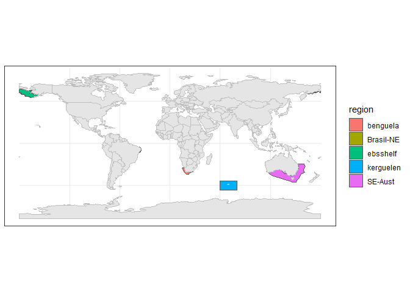
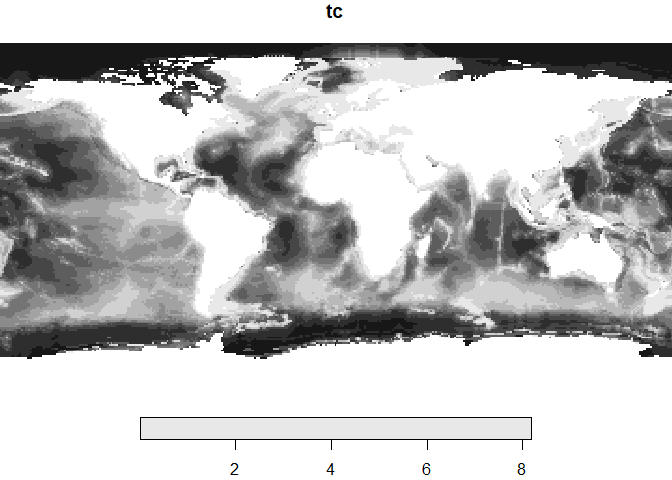
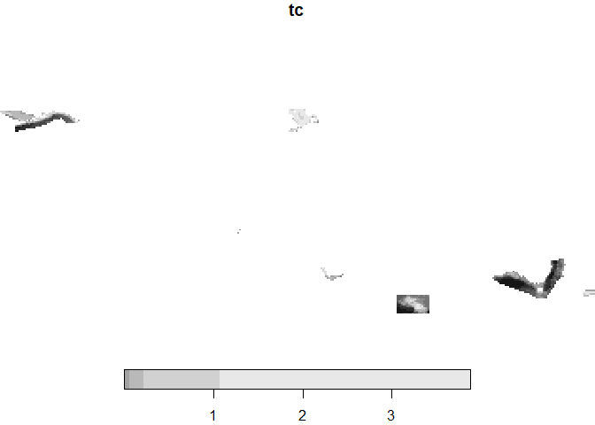
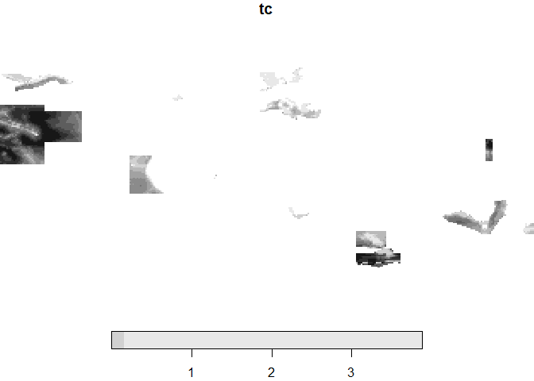
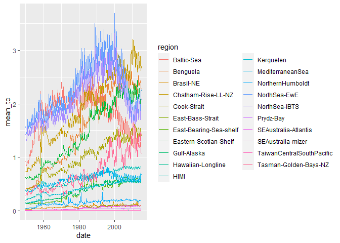

Creating your own mask from a shapefile
================
Denisse Fierro Arcos
2022-08-30

-   <a href="#introduction" id="toc-introduction">Introduction</a>
-   <a href="#loading-r-libraries" id="toc-loading-r-libraries">Loading R
    libraries</a>
-   <a href="#loading-shapefiles" id="toc-loading-shapefiles">Loading
    shapefiles</a>
    -   <a href="#getting-list-of-lme-names-from-directory-paths"
        id="toc-getting-list-of-lme-names-from-directory-paths">Getting list of
        LME names from directory paths</a>
    -   <a href="#getting-file-paths-for-shapefiles"
        id="toc-getting-file-paths-for-shapefiles">Getting file paths for
        shapefiles</a>
    -   <a href="#loading-regions" id="toc-loading-regions">Loading regions</a>
-   <a href="#plotting-merged-shapefile"
    id="toc-plotting-merged-shapefile">Plotting merged shapefile</a>
-   <a href="#saving-lme-polygons-as-a-single-shapefile"
    id="toc-saving-lme-polygons-as-a-single-shapefile">Saving LME polygons
    as a single shapefile</a>
-   <a href="#extract-data-with-multipolygon-feature"
    id="toc-extract-data-with-multipolygon-feature">Extract data with
    multipolygon feature</a>
-   <a href="#extract-data-from-raster"
    id="toc-extract-data-from-raster">Extract data from raster</a>
    -   <a href="#option-a-with-st_crop" id="toc-option-a-with-st_crop">Option A
        with <code>st_crop</code></a>
    -   <a href="#option-b-with-simple-mask"
        id="toc-option-b-with-simple-mask">Option B with simple mask</a>
-   <a href="#extracting-time-series"
    id="toc-extracting-time-series">Extracting time series</a>
-   <a href="#plotting-time-series" id="toc-plotting-time-series">Plotting
    time series</a>

## Introduction

This notebook will guide you through the steps of how to create a mask
using LME shapefiles used in the FishMIP project.

## Loading R libraries

``` r
library(sf)
library(tidyverse)
library(stringr)
library(stars)
library(geobgu)
```

## Loading shapefiles

LME shapefiles included in the FishMIP project are included under the
`Data` folder. First, we will get the file paths for these shapefiles.

### Getting list of LME names from directory paths

``` r
#Getting the names of directories containing the shapefiles for different regions of interest
names_regions <- list.dirs(path = "../Data/Shapefiles_Regions/", recursive = F, 
                           full.names = F)

#Extracting the names from the directories
names_regions <- str_split_fixed(names_regions, "_", n = 2)[,1]
names_regions
```

    ## [1] "benguela"  "Brasil-NE" "ebsshelf"  "kerguelen" "SE-Aust"

### Getting file paths for shapefiles

``` r
#Getting file paths
regions_paths <- list.files(path = "../Data/Shapefiles_Regions/", pattern = ".shp$", 
                            recursive = T, full.names = T)
regions_paths
```

    ## [1] "../Data/Shapefiles_Regions//benguela_shapefiles/model_regions_v3_geo.shp"        
    ## [2] "../Data/Shapefiles_Regions//Brasil-NE_regional_Model/BRA_NE_Model.shp"           
    ## [3] "../Data/Shapefiles_Regions//ebsshelf_all_shp/ebsshelf_all.shp"                   
    ## [4] "../Data/Shapefiles_Regions//kerguelen_shapefiles/Ecopath_model_domain_curved.shp"
    ## [5] "../Data/Shapefiles_Regions//SE-Aust_shapefiles/Atlantis_SE_boundary_box.shp"

### Loading regions

We must first ensure that all shapefiles are in the same coordinate
reference system (CRS) prior to creating a single shapefile. We will
load each shapefile into a list and change the CRS if necessary. We are
also making sure that any shapefiles that cross the international
dateline are shown correctly when WGS84 CRS (EPSG:4326) is assigned.

``` r
#Create empty list to store shapefiles
AOI_list <- list()

for(i in seq_along(regions_paths)){
  #Load original shapefile
  reg_raw <- read_sf(regions_paths[i]) %>%
    mutate(region = names_regions[i])
  #Check shapefile CRS. If none assigned and geometry is between -180 and +180, then assign WGS84
  if(st_crs(reg_raw) == "" | is.na(st_crs(reg_raw)) | is.null(st_crs(reg_raw))){
    if(sum(reg_raw$geometry[[1]][[1]] > 180) == F & sum(reg_raw$geometry[[1]][[1]] < -180) == F){
      st_crs(reg_raw) <- 4326}
    #If the shapefile has a CRS different to 4326, then transform it to WGS84
    }else if(st_crs(reg_raw) != st_crs(4326)){
      reg_raw <- st_transform(reg_raw, 4326) %>% 
        #Make sure it wraps around the international dateline
        st_wrap_dateline(options = c("WRAPDATELINE=YES", "DATELINEOFFSET=180"))
    }
  #Remove internal region boundaries
  reg_raw <- reg_raw %>% 
    group_by(region) %>% 
    summarise()
  
  #Saving shapefiles in empty list
  AOI_list[[i]] <- reg_raw
}
```

    ## st_as_s2(): dropping Z and/or M coordinate

Now that all shapefiles are in the same CRS, we can create a single
shapefile for all LME regions.

``` r
LMEs <- AOI_list %>% 
  bind_rows()
```

## Plotting merged shapefile

``` r
#We will load a world map for reference
land <- rnaturalearth::ne_countries(type = "countries", returnclass = "sf")

#Plotting LMEs over world map
LMEs %>% 
  ggplot()+
  geom_sf(aes(fill = region))+
  geom_sf(data = land, inherit.aes = F, color = "gray")+
  theme_bw()
```

<!-- -->

## Saving LME polygons as a single shapefile

``` r
st_write(LMEs, "../Data/Masks/FishMIP_LMEs_all.shp", append = F)
```

    ## Deleting layer `FishMIP_LMEs_all' using driver `ESRI Shapefile'
    ## Writing layer `FishMIP_LMEs_all' to data source 
    ##   `../Data/Masks/FishMIP_LMEs_all.shp' using driver `ESRI Shapefile'
    ## Writing 5 features with 1 fields and geometry type Unknown (any).

## Extract data with multipolygon feature

Finally, we will use the newly created shapefile to extract data for our
regions of interest.

``` r
#Loading sample raster from disk
data_file <- "../Data/ecoocean_gfdl-esm4_nobasd_historical_histsoc_default_tc_global_monthly_1950_2014.nc"
tc_raster <- read_stars(data_file)%>% 
  st_set_crs(st_crs(LMEs))
names(tc_raster) <- "tc"

max_val <- max(tc_raster$tc)

#Masking land values
tc_raster <- st_apply(tc_raster, "time", function(x) na_if(x, as.numeric(max_val)))
```

Plotting one time step as an example.

``` r
tc1 <- tc_raster %>%
  slice(index = 1, along = "time")
plot(tc1)
```

<!-- -->

## Extract data from raster

### Option A with `st_crop`

``` r
tc1_crop <- st_crop(tc1, LMEs)
plot(tc1_crop)
```

<!-- -->

### Option B with simple mask

``` r
tc1_crop2 <- tc1[LMEs]
plot(tc1_crop2)
```

<!-- -->

## Extracting time series

Get the dates for time steps in raster

``` r
time_steps <- st_get_dimension_values(tc_raster, "time")
head(time_steps)
```

    ## [1] "1950-01-01" "1950-02-01" "1950-03-01" "1950-04-01" "1950-05-01"
    ## [6] "1950-06-01"

## Plotting time series

Extracting mean per timestep. Showing timeseries for one region only.

``` r
#Extracting data for all timesteps
lme_extract <- LMEs %>% 
  mutate(mean = raster_extract(tc_raster, LMEs, fun = mean, na.rm = T))

#Transforming shapefile into dataframe
lme_extract <- lme_extract %>% 
  st_drop_geometry()

#Shaping dataframe better before plotting
ts_lme <- as.data.frame(lme_extract$mean)
names(ts_lme) <- time_steps
ts_lme <- ts_lme %>% 
  mutate(region = lme_extract$region, .before = 1) %>% 
  pivot_longer(!region, names_to = "date", values_to = "mean_tc") %>% 
  mutate(date = lubridate::ymd(date),
         region = factor(region))

#Plotting results
ts_lme %>%  
  ggplot(aes(date, mean_tc))+
  geom_line(aes(colour = region))
```

<!-- -->
