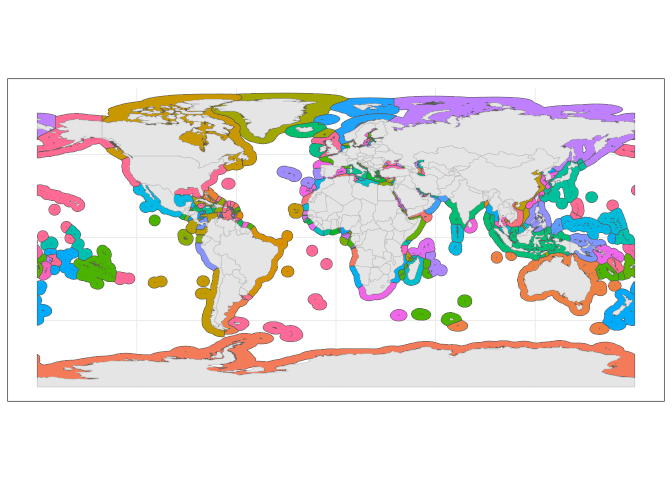
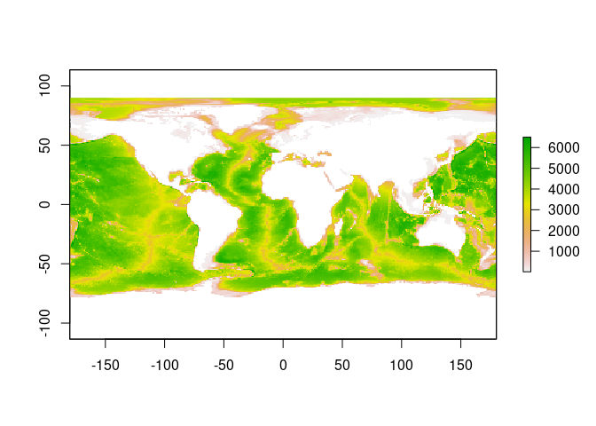
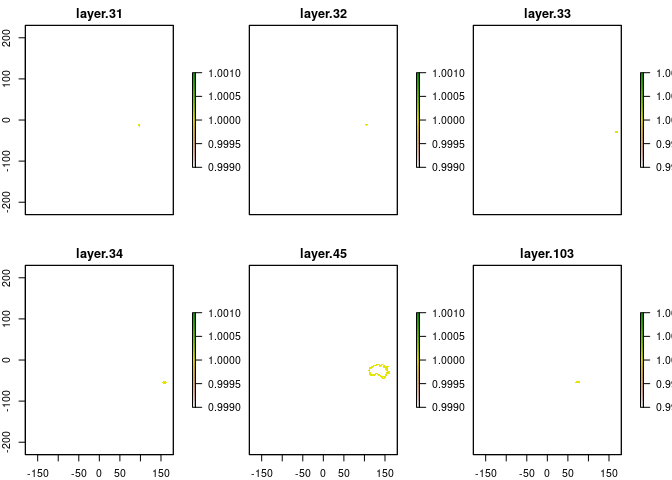
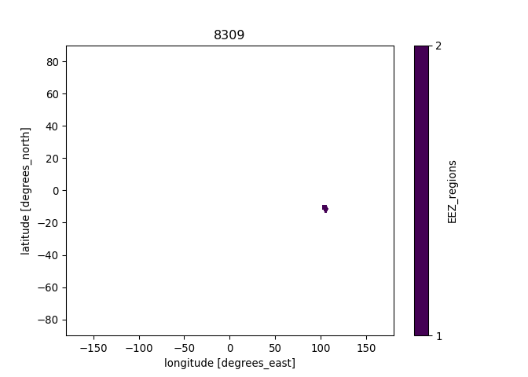
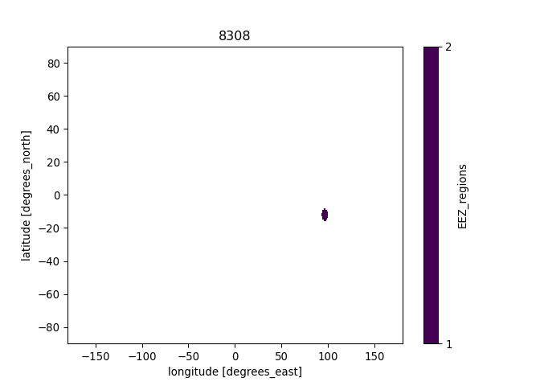
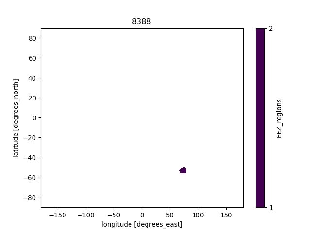
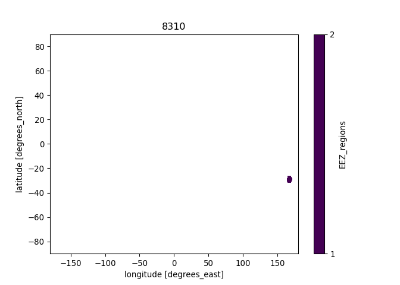
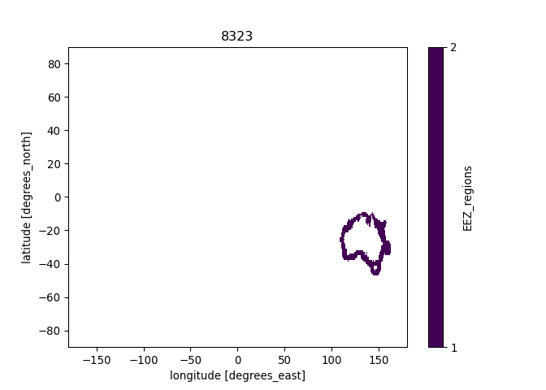
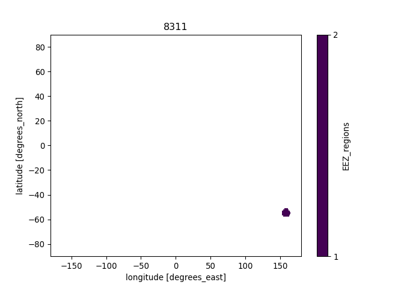

Creating raster mask from EEZs of the world shapefile
================
Denisse Fierro Arcos
2022-11-07

- <a href="#introduction" id="toc-introduction">Introduction</a>
- <a href="#loading-r-libraries" id="toc-loading-r-libraries">Loading R
  libraries</a>
- <a href="#loading-shapefiles" id="toc-loading-shapefiles">Loading
  shapefiles</a>
- <a href="#plotting-fao-regions-shapefile"
  id="toc-plotting-fao-regions-shapefile">Plotting FAO regions
  shapefile</a>
- <a href="#extracting-names-and-codes-for-eez"
  id="toc-extracting-names-and-codes-for-eez">Extracting names and codes
  for EEZ</a>
- <a href="#creating-a-multilayer-raster-mask-based-on-merged-shapefile"
  id="toc-creating-a-multilayer-raster-mask-based-on-merged-shapefile">Creating
  a multilayer raster mask based on merged shapefile</a>
  - <a href="#loading-input-rasters" id="toc-loading-input-rasters">Loading
    input rasters</a>
  - <a href="#defining-function-to-create-rasters-from-shapefiles"
    id="toc-defining-function-to-create-rasters-from-shapefiles">Defining
    function to create rasters from shapefiles</a>
  - <a href="#applying-raster-creation-function"
    id="toc-applying-raster-creation-function">Applying raster creation
    function</a>
- <a href="#python-based-code"
  id="toc-python-based-code"><code>Python</code>-based code</a>
  - <a href="#loading-libraries" id="toc-loading-libraries">Loading
    libraries</a>
  - <a href="#loading-raster-using-xarray"
    id="toc-loading-raster-using-xarray">Loading raster using
    <code>xarray</code></a>
  - <a href="#plotting-results" id="toc-plotting-results">Plotting
    results</a>
  - <a href="#creating-a-2d-mask-in-csv-format"
    id="toc-creating-a-2d-mask-in-csv-format">Creating a 2D mask in
    <code>csv</code> format</a>

## Introduction

The EEZs the of the world shapefile came from
[VLIZ](https://doi.org/10.14284/386). Rasters are created in `R` and the
final details are done with `xarray` library for `Python`.

## Loading R libraries

``` r
library(sf)
library(raster)
library(tidyverse)
library(reticulate)
```

## Loading shapefiles

The original shapefile contained a couple of errors: 1. The country of
Mauritius appeared as both Mauritius and Republic of Mauritius, however
they both referred to the same country as their country code was the
same for both: MUS. 2. The United Kingdom appeared twice with two
different countries codes. GBR has been kept as the unique code to
represent this country.

The section below loads the file, selects a subset of columns of
interest and corrects the errors identified above.

``` r
#Load shapefile with EEZ
eez_world <- read_sf("../Spatial_Data/World_EEZ_v11_20191118/eez_v11.shp") %>%
   #Subset of columns
  select(MRGID, GEONAME, POL_TYPE, SOVEREIGN1, SOVEREIGN2, SOVEREIGN3, AREA_KM2) %>% 
  #Turning character columns into factors
  mutate_if(is.character, as.factor)

#We can check the results of the first two rows
head(eez_world, 2)
```

    ## Simple feature collection with 2 features and 7 fields
    ## Geometry type: MULTIPOLYGON
    ## Dimension:     XY
    ## Bounding box:  xmin: -173.7747 ymin: -17.55527 xmax: -10.93248 ymax: -4.537529
    ## Geodetic CRS:  WGS 84
    ## # A tibble: 2 × 8
    ##   MRGID GEONAME                          POL_T…¹ SOVER…² SOVER…³ SOVER…⁴ AREA_…⁵
    ##   <dbl> <fct>                            <fct>   <fct>   <fct>   <fct>     <dbl>
    ## 1  8444 American Samoa Exclusive Econom… 200NM   United… <NA>    <NA>     405830
    ## 2  8379 Ascension Exclusive Economic Zo… 200NM   United… <NA>    <NA>     446005
    ## # … with 1 more variable: geometry <MULTIPOLYGON [°]>, and abbreviated variable
    ## #   names ¹​POL_TYPE, ²​SOVEREIGN1, ³​SOVEREIGN2, ⁴​SOVEREIGN3, ⁵​AREA_KM2

``` r
#Identify EEZ and countries associated with them from extracted data files
eez_names_codes <- eez_world %>% 
  st_drop_geometry()
```

Saving the shapefile and keys for reference.

``` r
#Saving the corrected shapefile
eez_world %>% 
  st_write("../Spatial_Data/World_EEZ_v11_20191118/eez_short.shp", delete_layer = T)

#Saving keys
eez_names_codes %>% 
  write_csv("../Spatial_Data/World_EEZ_v11_20191118/eez_key.csv")
```

## Plotting FAO regions shapefile

``` r
#Loading land shapefile to include in plot
land <- rnaturalearth::ne_countries(type = "countries", returnclass = "sf")

#Plotting FAO shapefile
eez_world %>% 
  ggplot()+
  geom_sf(aes(fill = SOVEREIGN1))+
  geom_sf(data = land, inherit.aes = F, color = "gray")+
  theme_bw()+
  theme(legend.position = "none")
```

<!-- -->

## Extracting names and codes for EEZ

We will use this information to save correct names for regions in the
raster

``` r
#Create a data frame of unique FAO regions
eez_names_codes <-  eez_names_codes %>% 
  group_by(MRGID) %>% 
  group_keys()

#We can check some of the results
head(eez_names_codes, 2)
```

    ## # A tibble: 2 × 1
    ##   MRGID
    ##   <dbl>
    ## 1  3293
    ## 2  5668

## Creating a multilayer raster mask based on merged shapefile

We will now create a multilayer mask that matches the grid used in the
physical model forcings. Most models use the same 1 degree grid, with
the exception of the DBPM ecosystem model, which uses a different 1
degree grid, and the DBEM model, which uses a 0.5 degree grid.

Note that masks *must* match the grid of the model from which data is
being extracted. This means that you will need to create a new mask for
each grid that is different. In the chunk below, you will find the three
different grids identified in the ecosystem models.

### Loading input rasters

``` r
#Loading sample raster to be used as target for rasterising FAO regions
#Most ecosystem models use this one degree grid
ras <- raster("../Spatial_Data/InputRasters/gfdl-mom6-cobalt2_obsclim_deptho_onedeg_global_fixed.nc")
```

    ## Loading required namespace: ncdf4

``` r
#Sample from DBPM model
# ras <- raster("../Spatial_Data/InputRasters/dbpm_ipsl-cm6a-lr_nobasd_historical_nat_default_tcb_global_monthly_1850_2014.nc")[[1]]

#Sample from DBEM model
# ras <- raster("../Spatial_Data/InputRasters/dbem_ipsl-cm6a-lr_nobasd_historical_nat_default_tcb_global_annual_1951_2014.nc")[[1]]

#We will define a few extra variables to automate creation of file names for each mask
#Model resolution
res <- "1deg"

#Model associated with grid. Leave blank if multiple models use same grid
mod_name <- ""

#Plotting raster
plot(ras)
```

<!-- -->
\### Calculate grid area The `raster` package allows us to calculate the
area of grid cells in $km^2$ in just one line of code. We can save this
to calculate weighted means by area. We will use the raster above as a
base, and we will save the result on our disk.

``` r
#Calculating grid area
area_grid <- area(ras)

#Creating file name 
filename <- paste0("area_", res, mod_name, ".nc")

#Saving results
writeRaster(area_grid, file.path("../Spatial_Data/Masks", filename), format = "CDF", overwrite = T, 
            #We will save the variable names so they match the Fish-MIP models
            varname = "area", xname = "lon", yname = "lat", varunit = "km2")
```

### Defining function to create rasters from shapefiles

We will define our own function that will use the shapefiles above to
create rasters.

``` r
#Defining function which needs a shapefile and a raster as input
shp_to_raster <- function(shp, nc_raster){
  #The final raster will have ones where within the shapefile boundaries
  rasterize(shp, nc_raster, field = 1)
}
```

### Applying raster creation function

We will apply the function we defined above to all the polygons
contained within our shapefile. We can do this easily using the `map`
function from the `purrr` package.

``` r
#Split shapefile into regions prior to transforming into raster
eez_list <- eez_world %>% 
  group_by(MRGID) %>% 
  group_split()

#Applying function to raster list
grid_raster <- map(eez_list, shp_to_raster, ras) %>% 
  #Stacking rasters to create a single multilayer raster
  stack()

#Checking results of stacked raster (selected Australian EEZs)...
plot(grid_raster[[c(31:34, 45, 103)]])
```

<!-- -->

Finally, we save the outputs in our local machine.

``` r
#Define file name
filename <- paste0("EEZ-world_", res, "mask", mod_name, ".nc")

#Saving raster to disk
writeRaster(grid_raster, file.path("../Spatial_Data/Masks", filename), format = "CDF", overwrite = T,
            varname = "EEZ_regions", zname = "Country_EEZ")
```

# `Python`-based code

We will now start `Python` and save the correct names for the FAO
regions in the `netcdf` file we created in `R`.

``` r
#Activating conda
use_condaenv("CMIP6_data")
```

## Loading libraries

``` python
import xarray as xr
import numpy as np
import matplotlib.pyplot as plt
import pandas as pd
import os
```

## Loading raster using `xarray`

``` python
#Getting filename
fn = f'EEZ-world_{r.res}mask{r.mod_name}.nc'

#Loading multilayer raster as dataset
mask = xr.open_dataset(os.path.join('../Spatial_Data/Masks', fn))
#Checking saved file in R
mask
```

<div><svg style="position: absolute; width: 0; height: 0; overflow: hidden">
<defs>
<symbol id="icon-database" viewBox="0 0 32 32">
<path d="M16 0c-8.837 0-16 2.239-16 5v4c0 2.761 7.163 5 16 5s16-2.239 16-5v-4c0-2.761-7.163-5-16-5z"></path>
<path d="M16 17c-8.837 0-16-2.239-16-5v6c0 2.761 7.163 5 16 5s16-2.239 16-5v-6c0 2.761-7.163 5-16 5z"></path>
<path d="M16 26c-8.837 0-16-2.239-16-5v6c0 2.761 7.163 5 16 5s16-2.239 16-5v-6c0 2.761-7.163 5-16 5z"></path>
</symbol>
<symbol id="icon-file-text2" viewBox="0 0 32 32">
<path d="M28.681 7.159c-0.694-0.947-1.662-2.053-2.724-3.116s-2.169-2.030-3.116-2.724c-1.612-1.182-2.393-1.319-2.841-1.319h-15.5c-1.378 0-2.5 1.121-2.5 2.5v27c0 1.378 1.122 2.5 2.5 2.5h23c1.378 0 2.5-1.122 2.5-2.5v-19.5c0-0.448-0.137-1.23-1.319-2.841zM24.543 5.457c0.959 0.959 1.712 1.825 2.268 2.543h-4.811v-4.811c0.718 0.556 1.584 1.309 2.543 2.268zM28 29.5c0 0.271-0.229 0.5-0.5 0.5h-23c-0.271 0-0.5-0.229-0.5-0.5v-27c0-0.271 0.229-0.5 0.5-0.5 0 0 15.499-0 15.5 0v7c0 0.552 0.448 1 1 1h7v19.5z"></path>
<path d="M23 26h-14c-0.552 0-1-0.448-1-1s0.448-1 1-1h14c0.552 0 1 0.448 1 1s-0.448 1-1 1z"></path>
<path d="M23 22h-14c-0.552 0-1-0.448-1-1s0.448-1 1-1h14c0.552 0 1 0.448 1 1s-0.448 1-1 1z"></path>
<path d="M23 18h-14c-0.552 0-1-0.448-1-1s0.448-1 1-1h14c0.552 0 1 0.448 1 1s-0.448 1-1 1z"></path>
</symbol>
</defs>
</svg>
<style>/* CSS stylesheet for displaying xarray objects in jupyterlab.
 *
 */

:root {
  --xr-font-color0: var(--jp-content-font-color0, rgba(0, 0, 0, 1));
  --xr-font-color2: var(--jp-content-font-color2, rgba(0, 0, 0, 0.54));
  --xr-font-color3: var(--jp-content-font-color3, rgba(0, 0, 0, 0.38));
  --xr-border-color: var(--jp-border-color2, #e0e0e0);
  --xr-disabled-color: var(--jp-layout-color3, #bdbdbd);
  --xr-background-color: var(--jp-layout-color0, white);
  --xr-background-color-row-even: var(--jp-layout-color1, white);
  --xr-background-color-row-odd: var(--jp-layout-color2, #eeeeee);
}

html[theme=dark],
body[data-theme=dark],
body.vscode-dark {
  --xr-font-color0: rgba(255, 255, 255, 1);
  --xr-font-color2: rgba(255, 255, 255, 0.54);
  --xr-font-color3: rgba(255, 255, 255, 0.38);
  --xr-border-color: #1F1F1F;
  --xr-disabled-color: #515151;
  --xr-background-color: #111111;
  --xr-background-color-row-even: #111111;
  --xr-background-color-row-odd: #313131;
}

.xr-wrap {
  display: block !important;
  min-width: 300px;
  max-width: 700px;
}

.xr-text-repr-fallback {
  /* fallback to plain text repr when CSS is not injected (untrusted notebook) */
  display: none;
}

.xr-header {
  padding-top: 6px;
  padding-bottom: 6px;
  margin-bottom: 4px;
  border-bottom: solid 1px var(--xr-border-color);
}

.xr-header > div,
.xr-header > ul {
  display: inline;
  margin-top: 0;
  margin-bottom: 0;
}

.xr-obj-type,
.xr-array-name {
  margin-left: 2px;
  margin-right: 10px;
}

.xr-obj-type {
  color: var(--xr-font-color2);
}

.xr-sections {
  padding-left: 0 !important;
  display: grid;
  grid-template-columns: 150px auto auto 1fr 20px 20px;
}

.xr-section-item {
  display: contents;
}

.xr-section-item input {
  display: none;
}

.xr-section-item input + label {
  color: var(--xr-disabled-color);
}

.xr-section-item input:enabled + label {
  cursor: pointer;
  color: var(--xr-font-color2);
}

.xr-section-item input:enabled + label:hover {
  color: var(--xr-font-color0);
}

.xr-section-summary {
  grid-column: 1;
  color: var(--xr-font-color2);
  font-weight: 500;
}

.xr-section-summary > span {
  display: inline-block;
  padding-left: 0.5em;
}

.xr-section-summary-in:disabled + label {
  color: var(--xr-font-color2);
}

.xr-section-summary-in + label:before {
  display: inline-block;
  content: '►';
  font-size: 11px;
  width: 15px;
  text-align: center;
}

.xr-section-summary-in:disabled + label:before {
  color: var(--xr-disabled-color);
}

.xr-section-summary-in:checked + label:before {
  content: '▼';
}

.xr-section-summary-in:checked + label > span {
  display: none;
}

.xr-section-summary,
.xr-section-inline-details {
  padding-top: 4px;
  padding-bottom: 4px;
}

.xr-section-inline-details {
  grid-column: 2 / -1;
}

.xr-section-details {
  display: none;
  grid-column: 1 / -1;
  margin-bottom: 5px;
}

.xr-section-summary-in:checked ~ .xr-section-details {
  display: contents;
}

.xr-array-wrap {
  grid-column: 1 / -1;
  display: grid;
  grid-template-columns: 20px auto;
}

.xr-array-wrap > label {
  grid-column: 1;
  vertical-align: top;
}

.xr-preview {
  color: var(--xr-font-color3);
}

.xr-array-preview,
.xr-array-data {
  padding: 0 5px !important;
  grid-column: 2;
}

.xr-array-data,
.xr-array-in:checked ~ .xr-array-preview {
  display: none;
}

.xr-array-in:checked ~ .xr-array-data,
.xr-array-preview {
  display: inline-block;
}

.xr-dim-list {
  display: inline-block !important;
  list-style: none;
  padding: 0 !important;
  margin: 0;
}

.xr-dim-list li {
  display: inline-block;
  padding: 0;
  margin: 0;
}

.xr-dim-list:before {
  content: '(';
}

.xr-dim-list:after {
  content: ')';
}

.xr-dim-list li:not(:last-child):after {
  content: ',';
  padding-right: 5px;
}

.xr-has-index {
  font-weight: bold;
}

.xr-var-list,
.xr-var-item {
  display: contents;
}

.xr-var-item > div,
.xr-var-item label,
.xr-var-item > .xr-var-name span {
  background-color: var(--xr-background-color-row-even);
  margin-bottom: 0;
}

.xr-var-item > .xr-var-name:hover span {
  padding-right: 5px;
}

.xr-var-list > li:nth-child(odd) > div,
.xr-var-list > li:nth-child(odd) > label,
.xr-var-list > li:nth-child(odd) > .xr-var-name span {
  background-color: var(--xr-background-color-row-odd);
}

.xr-var-name {
  grid-column: 1;
}

.xr-var-dims {
  grid-column: 2;
}

.xr-var-dtype {
  grid-column: 3;
  text-align: right;
  color: var(--xr-font-color2);
}

.xr-var-preview {
  grid-column: 4;
}

.xr-var-name,
.xr-var-dims,
.xr-var-dtype,
.xr-preview,
.xr-attrs dt {
  white-space: nowrap;
  overflow: hidden;
  text-overflow: ellipsis;
  padding-right: 10px;
}

.xr-var-name:hover,
.xr-var-dims:hover,
.xr-var-dtype:hover,
.xr-attrs dt:hover {
  overflow: visible;
  width: auto;
  z-index: 1;
}

.xr-var-attrs,
.xr-var-data {
  display: none;
  background-color: var(--xr-background-color) !important;
  padding-bottom: 5px !important;
}

.xr-var-attrs-in:checked ~ .xr-var-attrs,
.xr-var-data-in:checked ~ .xr-var-data {
  display: block;
}

.xr-var-data > table {
  float: right;
}

.xr-var-name span,
.xr-var-data,
.xr-attrs {
  padding-left: 25px !important;
}

.xr-attrs,
.xr-var-attrs,
.xr-var-data {
  grid-column: 1 / -1;
}

dl.xr-attrs {
  padding: 0;
  margin: 0;
  display: grid;
  grid-template-columns: 125px auto;
}

.xr-attrs dt,
.xr-attrs dd {
  padding: 0;
  margin: 0;
  float: left;
  padding-right: 10px;
  width: auto;
}

.xr-attrs dt {
  font-weight: normal;
  grid-column: 1;
}

.xr-attrs dt:hover span {
  display: inline-block;
  background: var(--xr-background-color);
  padding-right: 10px;
}

.xr-attrs dd {
  grid-column: 2;
  white-space: pre-wrap;
  word-break: break-all;
}

.xr-icon-database,
.xr-icon-file-text2 {
  display: inline-block;
  vertical-align: middle;
  width: 1em;
  height: 1.5em !important;
  stroke-width: 0;
  stroke: currentColor;
  fill: currentColor;
}
</style><pre class='xr-text-repr-fallback'>&lt;xarray.Dataset&gt;
Dimensions:      (longitude: 360, latitude: 180, Country_EEZ: 281)
Coordinates:
  * longitude    (longitude) float64 -179.5 -178.5 -177.5 ... 177.5 178.5 179.5
  * latitude     (latitude) float64 89.5 88.5 87.5 86.5 ... -87.5 -88.5 -89.5
  * Country_EEZ  (Country_EEZ) int32 1 2 3 4 5 6 7 ... 276 277 278 279 280 281
Data variables:
    crs          int32 -2147483647
    EEZ_regions  (Country_EEZ, latitude, longitude) float32 ...
Attributes:
    Conventions:  CF-1.4
    created_by:   R, packages ncdf4 and raster (version 3.5-29)
    date:         2022-12-15 18:10:52</pre><div class='xr-wrap' style='display:none'><div class='xr-header'><div class='xr-obj-type'>xarray.Dataset</div></div><ul class='xr-sections'><li class='xr-section-item'><input id='section-3b2a9add-0364-4a78-93b4-d1ca63d8f899' class='xr-section-summary-in' type='checkbox' disabled ><label for='section-3b2a9add-0364-4a78-93b4-d1ca63d8f899' class='xr-section-summary'  title='Expand/collapse section'>Dimensions:</label><div class='xr-section-inline-details'><ul class='xr-dim-list'><li><span class='xr-has-index'>longitude</span>: 360</li><li><span class='xr-has-index'>latitude</span>: 180</li><li><span class='xr-has-index'>Country_EEZ</span>: 281</li></ul></div><div class='xr-section-details'></div></li><li class='xr-section-item'><input id='section-97753336-35ee-4def-9035-dccad48ff7da' class='xr-section-summary-in' type='checkbox'  checked><label for='section-97753336-35ee-4def-9035-dccad48ff7da' class='xr-section-summary' >Coordinates: <span>(3)</span></label><div class='xr-section-inline-details'></div><div class='xr-section-details'><ul class='xr-var-list'><li class='xr-var-item'><div class='xr-var-name'><span class='xr-has-index'>longitude</span></div><div class='xr-var-dims'>(longitude)</div><div class='xr-var-dtype'>float64</div><div class='xr-var-preview xr-preview'>-179.5 -178.5 ... 178.5 179.5</div><input id='attrs-4b080504-4124-4fed-a276-e89ce0a17d37' class='xr-var-attrs-in' type='checkbox' ><label for='attrs-4b080504-4124-4fed-a276-e89ce0a17d37' title='Show/Hide attributes'><svg class='icon xr-icon-file-text2'><use xlink:href='#icon-file-text2'></use></svg></label><input id='data-35d6540b-dda2-4604-8a79-dade5234ed7e' class='xr-var-data-in' type='checkbox'><label for='data-35d6540b-dda2-4604-8a79-dade5234ed7e' title='Show/Hide data repr'><svg class='icon xr-icon-database'><use xlink:href='#icon-database'></use></svg></label><div class='xr-var-attrs'><dl class='xr-attrs'><dt><span>units :</span></dt><dd>degrees_east</dd><dt><span>long_name :</span></dt><dd>longitude</dd></dl></div><div class='xr-var-data'><pre>array([-179.5, -178.5, -177.5, ...,  177.5,  178.5,  179.5])</pre></div></li><li class='xr-var-item'><div class='xr-var-name'><span class='xr-has-index'>latitude</span></div><div class='xr-var-dims'>(latitude)</div><div class='xr-var-dtype'>float64</div><div class='xr-var-preview xr-preview'>89.5 88.5 87.5 ... -88.5 -89.5</div><input id='attrs-35174cb8-79bb-4e81-a062-46d58973c57a' class='xr-var-attrs-in' type='checkbox' ><label for='attrs-35174cb8-79bb-4e81-a062-46d58973c57a' title='Show/Hide attributes'><svg class='icon xr-icon-file-text2'><use xlink:href='#icon-file-text2'></use></svg></label><input id='data-3208c7a4-20eb-4339-999c-378a9b1fb20f' class='xr-var-data-in' type='checkbox'><label for='data-3208c7a4-20eb-4339-999c-378a9b1fb20f' title='Show/Hide data repr'><svg class='icon xr-icon-database'><use xlink:href='#icon-database'></use></svg></label><div class='xr-var-attrs'><dl class='xr-attrs'><dt><span>units :</span></dt><dd>degrees_north</dd><dt><span>long_name :</span></dt><dd>latitude</dd></dl></div><div class='xr-var-data'><pre>array([ 89.5,  88.5,  87.5,  86.5,  85.5,  84.5,  83.5,  82.5,  81.5,  80.5,
        79.5,  78.5,  77.5,  76.5,  75.5,  74.5,  73.5,  72.5,  71.5,  70.5,
        69.5,  68.5,  67.5,  66.5,  65.5,  64.5,  63.5,  62.5,  61.5,  60.5,
        59.5,  58.5,  57.5,  56.5,  55.5,  54.5,  53.5,  52.5,  51.5,  50.5,
        49.5,  48.5,  47.5,  46.5,  45.5,  44.5,  43.5,  42.5,  41.5,  40.5,
        39.5,  38.5,  37.5,  36.5,  35.5,  34.5,  33.5,  32.5,  31.5,  30.5,
        29.5,  28.5,  27.5,  26.5,  25.5,  24.5,  23.5,  22.5,  21.5,  20.5,
        19.5,  18.5,  17.5,  16.5,  15.5,  14.5,  13.5,  12.5,  11.5,  10.5,
         9.5,   8.5,   7.5,   6.5,   5.5,   4.5,   3.5,   2.5,   1.5,   0.5,
        -0.5,  -1.5,  -2.5,  -3.5,  -4.5,  -5.5,  -6.5,  -7.5,  -8.5,  -9.5,
       -10.5, -11.5, -12.5, -13.5, -14.5, -15.5, -16.5, -17.5, -18.5, -19.5,
       -20.5, -21.5, -22.5, -23.5, -24.5, -25.5, -26.5, -27.5, -28.5, -29.5,
       -30.5, -31.5, -32.5, -33.5, -34.5, -35.5, -36.5, -37.5, -38.5, -39.5,
       -40.5, -41.5, -42.5, -43.5, -44.5, -45.5, -46.5, -47.5, -48.5, -49.5,
       -50.5, -51.5, -52.5, -53.5, -54.5, -55.5, -56.5, -57.5, -58.5, -59.5,
       -60.5, -61.5, -62.5, -63.5, -64.5, -65.5, -66.5, -67.5, -68.5, -69.5,
       -70.5, -71.5, -72.5, -73.5, -74.5, -75.5, -76.5, -77.5, -78.5, -79.5,
       -80.5, -81.5, -82.5, -83.5, -84.5, -85.5, -86.5, -87.5, -88.5, -89.5])</pre></div></li><li class='xr-var-item'><div class='xr-var-name'><span class='xr-has-index'>Country_EEZ</span></div><div class='xr-var-dims'>(Country_EEZ)</div><div class='xr-var-dtype'>int32</div><div class='xr-var-preview xr-preview'>1 2 3 4 5 6 ... 277 278 279 280 281</div><input id='attrs-ade2438f-ca53-432b-bc59-d6d542c59ddf' class='xr-var-attrs-in' type='checkbox' ><label for='attrs-ade2438f-ca53-432b-bc59-d6d542c59ddf' title='Show/Hide attributes'><svg class='icon xr-icon-file-text2'><use xlink:href='#icon-file-text2'></use></svg></label><input id='data-d765fe97-e93f-4586-b990-f1b2f89a2200' class='xr-var-data-in' type='checkbox'><label for='data-d765fe97-e93f-4586-b990-f1b2f89a2200' title='Show/Hide data repr'><svg class='icon xr-icon-database'><use xlink:href='#icon-database'></use></svg></label><div class='xr-var-attrs'><dl class='xr-attrs'><dt><span>units :</span></dt><dd>unknown</dd><dt><span>long_name :</span></dt><dd>Country_EEZ</dd></dl></div><div class='xr-var-data'><pre>array([  1,   2,   3, ..., 279, 280, 281], dtype=int32)</pre></div></li></ul></div></li><li class='xr-section-item'><input id='section-b36896f4-bcc5-4e59-85e9-edd8ddb91732' class='xr-section-summary-in' type='checkbox'  checked><label for='section-b36896f4-bcc5-4e59-85e9-edd8ddb91732' class='xr-section-summary' >Data variables: <span>(2)</span></label><div class='xr-section-inline-details'></div><div class='xr-section-details'><ul class='xr-var-list'><li class='xr-var-item'><div class='xr-var-name'><span>crs</span></div><div class='xr-var-dims'>()</div><div class='xr-var-dtype'>int32</div><div class='xr-var-preview xr-preview'>...</div><input id='attrs-d892a1a2-5e35-4987-8a70-2e131eb2ba12' class='xr-var-attrs-in' type='checkbox' ><label for='attrs-d892a1a2-5e35-4987-8a70-2e131eb2ba12' title='Show/Hide attributes'><svg class='icon xr-icon-file-text2'><use xlink:href='#icon-file-text2'></use></svg></label><input id='data-7157a628-825a-4987-ad28-b84e83c62691' class='xr-var-data-in' type='checkbox'><label for='data-7157a628-825a-4987-ad28-b84e83c62691' title='Show/Hide data repr'><svg class='icon xr-icon-database'><use xlink:href='#icon-database'></use></svg></label><div class='xr-var-attrs'><dl class='xr-attrs'><dt><span>proj4 :</span></dt><dd>+proj=longlat +datum=WGS84 +no_defs</dd></dl></div><div class='xr-var-data'><pre>array(-2147483647, dtype=int32)</pre></div></li><li class='xr-var-item'><div class='xr-var-name'><span>EEZ_regions</span></div><div class='xr-var-dims'>(Country_EEZ, latitude, longitude)</div><div class='xr-var-dtype'>float32</div><div class='xr-var-preview xr-preview'>...</div><input id='attrs-19ed92cd-1cbe-49bd-bb3e-30a31a0aed11' class='xr-var-attrs-in' type='checkbox' ><label for='attrs-19ed92cd-1cbe-49bd-bb3e-30a31a0aed11' title='Show/Hide attributes'><svg class='icon xr-icon-file-text2'><use xlink:href='#icon-file-text2'></use></svg></label><input id='data-7ffb6d0f-0b7a-4233-b02f-73e7ee5fb17f' class='xr-var-data-in' type='checkbox'><label for='data-7ffb6d0f-0b7a-4233-b02f-73e7ee5fb17f' title='Show/Hide data repr'><svg class='icon xr-icon-database'><use xlink:href='#icon-database'></use></svg></label><div class='xr-var-attrs'><dl class='xr-attrs'><dt><span>grid_mapping :</span></dt><dd>crs</dd><dt><span>proj4 :</span></dt><dd>+proj=longlat +datum=WGS84 +no_defs</dd><dt><span>min :</span></dt><dd>[ 1.  1.  1.  1.  1.  1.  1.  1.  1.  1.  1.  1.  1.  1.  1.  1.  1.  1.
  1.  1.  1.  1.  1.  1. inf  1.  1.  1.  1.  1.  1.  1.  1.  1.  1.  1.
  1.  1.  1.  1.  1.  1.  1.  1.  1.  1.  1.  1.  1.  1.  1.  1.  1.  1.
  1.  1.  1.  1.  1.  1.  1.  1.  1.  1.  1.  1.  1.  1.  1.  1.  1.  1.
  1.  1.  1.  1.  1.  1.  1.  1. inf  1.  1.  1.  1.  1.  1.  1.  1.  1.
  1.  1.  1.  1.  1.  1.  1.  1.  1.  1.  1.  1.  1.  1.  1.  1.  1.  1.
  1.  1.  1.  1.  1.  1.  1.  1.  1.  1.  1.  1.  1.  1.  1.  1.  1.  1.
  1.  1.  1.  1.  1.  1.  1.  1.  1.  1.  1.  1.  1.  1.  1.  1.  1.  1.
  1.  1.  1.  1.  1.  1.  1.  1.  1.  1.  1.  1.  1.  1.  1.  1.  1.  1.
  1.  1.  1.  1.  1.  1.  1.  1.  1.  1.  1.  1.  1.  1.  1.  1. inf  1.
  1.  1.  1.  1.  1.  1.  1.  1.  1.  1.  1.  1.  1. inf  1.  1.  1.  1.
  1. inf  1.  1.  1. inf  1.  1.  1. inf inf inf  1.  1.  1.  1. inf inf
  1.  1.  1.  1.  1.  1.  1.  1.  1. inf  1.  1.  1.  1.  1.  1.  1. inf
  1.  1.  1.  1. inf  1.  1.  1. inf inf  1. inf inf  1.  1.  1.  1. inf
  1. inf  1. inf inf inf inf inf  1.  1. inf inf  1.  1.  1. inf inf inf
 inf inf inf inf inf  1. inf inf  1.  1. inf]</dd><dt><span>max :</span></dt><dd>[  1.   1.   1.   1.   1.   1.   1.   1.   1.   1.   1.   1.   1.   1.
   1.   1.   1.   1.   1.   1.   1.   1.   1.   1. -inf   1.   1.   1.
   1.   1.   1.   1.   1.   1.   1.   1.   1.   1.   1.   1.   1.   1.
   1.   1.   1.   1.   1.   1.   1.   1.   1.   1.   1.   1.   1.   1.
   1.   1.   1.   1.   1.   1.   1.   1.   1.   1.   1.   1.   1.   1.
   1.   1.   1.   1.   1.   1.   1.   1.   1.   1. -inf   1.   1.   1.
   1.   1.   1.   1.   1.   1.   1.   1.   1.   1.   1.   1.   1.   1.
   1.   1.   1.   1.   1.   1.   1.   1.   1.   1.   1.   1.   1.   1.
   1.   1.   1.   1.   1.   1.   1.   1.   1.   1.   1.   1.   1.   1.
   1.   1.   1.   1.   1.   1.   1.   1.   1.   1.   1.   1.   1.   1.
   1.   1.   1.   1.   1.   1.   1.   1.   1.   1.   1.   1.   1.   1.
   1.   1.   1.   1.   1.   1.   1.   1.   1.   1.   1.   1.   1.   1.
   1.   1.   1.   1.   1.   1.   1.   1.   1.   1. -inf   1.   1.   1.
   1.   1.   1.   1.   1.   1.   1.   1.   1.   1.   1. -inf   1.   1.
   1.   1.   1. -inf   1.   1.   1. -inf   1.   1.   1. -inf -inf -inf
   1.   1.   1.   1. -inf -inf   1.   1.   1.   1.   1.   1.   1.   1.
   1. -inf   1.   1.   1.   1.   1.   1.   1. -inf   1.   1.   1.   1.
 -inf   1.   1.   1. -inf -inf   1. -inf -inf   1.   1.   1.   1. -inf
   1. -inf   1. -inf -inf -inf -inf -inf   1.   1. -inf -inf   1.   1.
   1. -inf -inf -inf -inf -inf -inf -inf -inf   1. -inf -inf   1.   1.
 -inf]</dd></dl></div><div class='xr-var-data'><pre>[18208800 values with dtype=float32]</pre></div></li></ul></div></li><li class='xr-section-item'><input id='section-8f5fcb66-225e-4b7d-bf09-beccacbd63d6' class='xr-section-summary-in' type='checkbox'  checked><label for='section-8f5fcb66-225e-4b7d-bf09-beccacbd63d6' class='xr-section-summary' >Attributes: <span>(3)</span></label><div class='xr-section-inline-details'></div><div class='xr-section-details'><dl class='xr-attrs'><dt><span>Conventions :</span></dt><dd>CF-1.4</dd><dt><span>created_by :</span></dt><dd>R, packages ncdf4 and raster (version 3.5-29)</dd><dt><span>date :</span></dt><dd>2022-12-15 18:10:52</dd></dl></div></li></ul></div></div>

Here we can see that the FAO region names are not saved correctly. They
are numbered based on its location on the shapefile. We can update this
using the data frame with the unique FAO regions we previously created.

``` python
#We can simply load the data frame from the R environment.
eez_keys = r.eez_names_codes

#Checking list
eez_keys
```

    ##        MRGID
    ## 0     3293.0
    ## 1     5668.0
    ## 2     5669.0
    ## 3     5670.0
    ## 4     5672.0
    ## ..       ...
    ## 276  50167.0
    ## 277  50170.0
    ## 278  62589.0
    ## 279  62596.0
    ## 280  62598.0
    ## 
    ## [281 rows x 1 columns]

We can now update the names on the `netcdf` file using the ID codes for
each EEZ.

``` python
#We will use the values in the data frame we loaded above
mask['Country_EEZ'] = [int(i) for i in eez_keys.MRGID]
```

We will load the full keys into memory and we will select all EEZ areas
for Australia to ensure masks are correct.

``` python
#Create filename 
#Loading keys
eez_full_keys = pd.read_csv('../Spatial_Data/World_EEZ_v11_20191118/eez_key.csv')

#Selecting Australian subset
aus_eez = mask.sel(Country_EEZ = eez_full_keys['MRGID'][eez_full_keys['SOVEREIGN1'] == 'Australia'].tolist()).EEZ_regions
```

## Plotting results

We will plot all regions below to ensure we got them all correctly.

``` python
#We will loop through the first five to check results
for reg in aus_eez:
  #Plotting results
  fig = plt.figure()
  ax = fig.add_subplot(111)
  reg.plot(ax = ax, levels = [1, 2])
  plt.title(reg.Country_EEZ.values.tolist())
  plt.show()
```



When comparing to the shapefile plots in the `R` section of this
notebook, we can see that the regions are named correctly. This means
that we can save our results now.

``` python
#Creating filename
fn = f'EEZ-world-corrected_{r.res}mask{r.mod_name}.nc'

mask.to_netcdf(os.path.join('../Spatial_Data/Masks', fn))
```

## Creating a 2D mask in `csv` format

Depending on the format of your data, it may be better to have a 2D mask
in `csv` format. We can create one using the raster we created in the
previous step. We will switch to `R` to complete this step.

``` r
#First we load our raster mask
filename <- paste0("EEZ-world-corrected_", res, "mask", mod_name, ".nc")
# We will load it as a stack
ras <- stack(file.path("../Spatial_Data/Masks", filename), 
             #This is the same variable name we used to create our original raster
             varname = "EEZ_regions")

#We will now convert our stack into points
ras_df <- rasterToPoints(ras) %>% 
  #Transforming form matrix to data frame
  as.data.frame() %>% 
  #Changing dimensions of data frame, so that our column names appear in the `ID_merged column`
  pivot_longer(cols = -c(x, y), names_to = "ID_merged") %>% 
  #We remove any rows containing only NA values
  drop_na(value) %>% 
  #We rename latitude and longitude column
  rename("Lon" = "x", "Lat" = "y") %>% 
  #We remove the `X` from the areas IDs
  mutate(ID_merged = as.integer(str_remove(ID_merged, 'X'))) %>% 
  #Remove the `value` column as it is now redundant
  select(-value)

#We can update our filename variable 
filename <- paste0("EEZ-world_", res, "mask", mod_name, ".csv")
#Saving the end file in your local machine
write_csv(ras_df, file = file.path("../Spatial_Data/Masks", filename))
```
