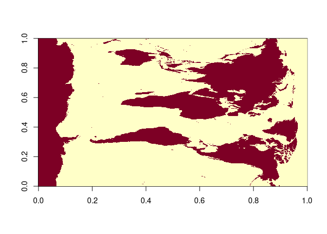
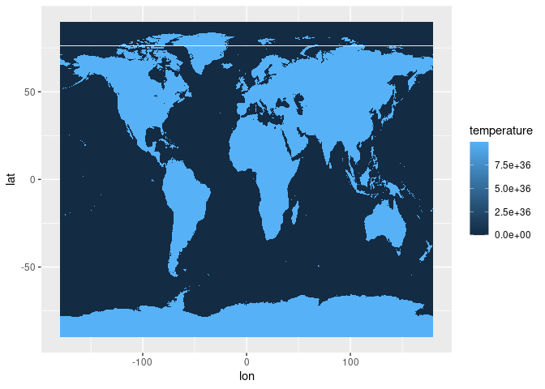
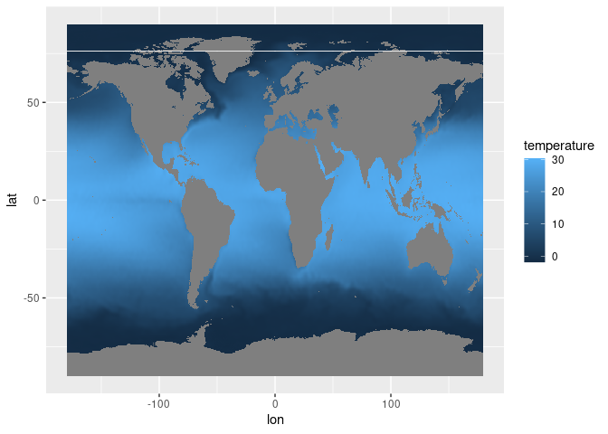

Loading zarr files
================
Denisse Fierro Arcos
10/9/24

# Loading `zarr` files in R

In this notebook, you will learn how to load `zarr` files using the
[`Rarr`](https://github.com/grimbough/Rarr) package, which can be
downloaded via `BiocManager` if you do not have it already installed in
your computer.

If you are using data downloaded from our [FishMIP Input Explorer
app](https://rstudio.global-ecosystem-model.cloud.edu.au/shiny/FishMIP_Input_Explorer/),
remember that the app offers the option to download `zarr` files as a
compressed (`zip`) folder only. To work with this data you will need to
unzip (i.e., uncompress) the folder **BEFORE** running this script.

Also note that not all variables are available to be downloaded as
`zarr` files in our app. Only variables that include a depth dimension
(e.g., Sea Water Potential Temperature) are offered in this format.

We should note that you can use this workflow to open any `zarr` files,
not only the ones available through our app.

## OPTIONAL: Install `Rarr` package

You only need to run this section if you do not have `BiocManager` and
`Rarr` already installed in your computer. Note that you only need to
run this code once to install these packages in your machine.

``` r
install.packages("BiocManager")
BiocManager::install("Rarr")
```

## Loading relevant libraries

Remember, if you already have `Rarr` installed in your computer, you do
not need run the chunk above.

``` r
library(Rarr)
library(tidyr)
library(dplyr)
```


    Attaching package: 'dplyr'

    The following objects are masked from 'package:stats':

        filter, lag

    The following objects are masked from 'package:base':

        intersect, setdiff, setequal, union

``` r
library(tibble)
library(ggplot2)
```

## Define the location of the `zarr` file

Include the full path to where the `zarr` file you want to open is
stored.

``` r
path_to_zarr <- "/rd/gem/public/fishmip/WOA_data/global/woa23_clim_mean_temp_1981-2010.zarr/"
```

## Exploring zarr file contents

It is a good idea to check the contents of the `zarr` file before you
attempt to open it.

``` r
zarr_overview(path_to_zarr)
```

    Type: Group of Arrays
    Path: /rd/gem/public/fishmip/WOA_data/global/woa23_clim_mean_temp_1981-2010.zarr
    Arrays:
    ---
      Path: depth
      Shape: 102
      Chunk Shape: 102
      No. of Chunks: 1 (1)
      Data Type: float32
      Endianness: little
      Compressor: blosc
    ---
      Path: lat
      Shape: 720
      Chunk Shape: 720
      No. of Chunks: 1 (1)
      Data Type: float32
      Endianness: little
      Compressor: blosc
    ---
      Path: lon
      Shape: 1440
      Chunk Shape: 1440
      No. of Chunks: 1 (1)
      Data Type: float32
      Endianness: little
      Compressor: blosc
    ---
      Path: t_an
      Shape: 102 x 720 x 1440
      Chunk Shape: 57 x 120 x 240
      No. of Chunks: 72 (2 x 6 x 6)
      Data Type: float32
      Endianness: little
      Compressor: blosc

We can interpret this output as follows:  
- Looking at the last section, we have a variable called `t_an` that has
three dimensions (`shape`: 102 x 720 x 1440)  
- These dimensions correspond to `depth` (length of 102), `lat` (length
720) and `lon` (length 1440).

We can guess what the dimensions refer to, but `t_an` is not a very
informative name, so it is a good idea to refer to the metadata to
interpret what this means. In this case, we know that this data came
from World Ocean Atlas (WOA) and based on their
[documentation](https://odv.awi.de/fileadmin/user_upload/odv/data/WOA23/woa23documentation.pdf),
`t_an` refers to the climatological mean (1981-2010) for ocean
temperature.

## Loading data

We will add the variable name to the end of the `zarr` path we defined
above to load all data.

``` r
temp_data <- read_zarr_array(file.path(path_to_zarr, "t_an"))
depth <- read_zarr_array(file.path(path_to_zarr, "depth"))
lat <- read_zarr_array(file.path(path_to_zarr, "lat"))
lon <- read_zarr_array(file.path(path_to_zarr, "lon"))
```

We can check what this looks like by plotting the first time step.
Remember, this is a three dimensional variable, which contains: `depth`
(length of 102), `lat` (length 720) and `lon` (length 1440).

``` r
#Check dimensions of temperature data
dim(temp_data)
```

    [1]  102  720 1440

They match the metadata, now we can plot it.

``` r
image(temp_data[1,,])
```



This does not look right, we need to process the data before we can plot
it properly. We already know the order of the dimensions and we have the
values for each of these, so we will create a data frame with all this
information.

``` r
#Creating a data frame from all components
#Note that dimensions need to match the order of dimensions in the temperature data
temp_df <- cbind(expand.grid(depth, lat, lon), 
                 val = as.vector(temp_data))

#We can rename the columns to reflect their contents
names(temp_df) <- c("depth", "lat", "lon", "temperature")

#We can plot the first depth bin to check we have process data correctly
temp_df |> 
  filter(depth == min(depth)) |> 
  ggplot(aes(lon, lat, fill = temperature)) +
  geom_tile()
```



This is much better, but we have some really high values, which have
been put in place to highlight land areas. We will correct this in the
data frame.

``` r
temp_df <- temp_df |> 
  mutate(temperature = case_when(temperature == max(temperature) ~ NA,
                                 T ~ temperature)) 
#Now let's plot the data again
temp_df |> 
  filter(depth == min(depth)) |> 
  ggplot(aes(lon, lat, fill = temperature)) +
  geom_tile()
```



This is what we would expect our data to look like. We can now save the
data frame as a `csv` file. Alternatively, we could create a raster
file.

``` r
write_csv(temp_df, "temp_woa_data.csv")
```
